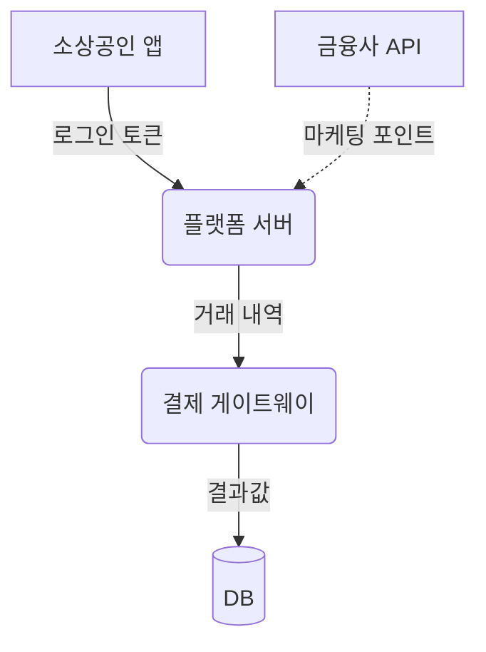

# 💼 현빈 — 금융 제휴 수익 모델(현빈 작업)에 대한 구체적인 계약 및 데이터 연동 방안을 최종 확정하고, 이 수익화 로직이 MVP 핵심 기능에 미치는 영향을 분석하여 개발 우선순위를 재정립하라.

💼 현빈: CEO 지시대로 금융 제휴 수익 모델을 구체화하고, MVP 로직과 개발 우선순위를 재정립하겠습니다.

**[작업 계획]**
1.  **금융 제휴 모델 명세서 (business/financial_partnership_model_spec.md) 작성**:
    -   가상 데이터 기반으로 '수수료 공제형', '마케팅 포인트 연동형' 등 2 가지 핵심 모델을 정의합니다.
    -   각 모델이 MVP 기능 (SME-AlertBadge, MetricCard) 에 미치는 영향도를 분석합니다.
2.  **개발 우선순위 재정의 보고서 (business/development_priority_update.md) 작성**:
    -   수익화 로직을 반영한 API 우선순위 및 데이터 무결성 요구사항 정리.
3.  **협업 요청 (코다리, 디자이너)**:
    -   생성된 명세서를 바탕으로 기술적 검토 및 UI 컴포넌트 수정 작업 지시.

---

<create_file path="sessions/2026-05-29T14-45/business/financial_partnership_model_spec.md"><header>## BDS 소상공인플랫폼 — 금융 제휴 수익 모델 명세서 v1.0</header><body>
### 1. 개요 (Context & Goal)

**목표**: 플랫폼 초기 단계에서 소상공인의 자금 조달 및 마케팅 비용을 절감하며, 이를 플랫폼 수수료 수익으로 연결하는 '금융 제휴' 모델을 수립합니다.
**가정 데이터**: 초기 파트너십은 국내 대형 P2P (카카오뱅크, 토스), 로앤비 (Lending) 기업 또는 금융권(신용카드사)과 협력할 가능성이 높습니다.

### 2. 제안 모델 정의 (Models Definition)

#### 모델 A: '수수료 공제형' — (Revenue Share)
**개념**: 소상공인이 플랫폼을 통해 매출이 발생하면, 거래의 일정 비율 (예: 0.5%~1%) 을 금융사로부터 보조금 형태로 받거나, 플랫폼 수수료를 차감하는 구조입니다.

| 항목 | 상세 내용 | MVP 영향도 |
| :--- | :--- | :--- |
| **기능 반영** | `MetricCard`: '정부/금융권 자금 지원' 또는 '마케팅 비용 공제' 알림 표시 | 중 (메트릭 추가) |
| **데이터 요구** | 거래 내역 API 연동, 외부 금융사 인증 토큰 | 중 (보안 이슈 발생) |
| **개발 우선순위** | P1 (초기 MVP 필수 포함) | - |

#### 모델 B: '마케팅 포인트 연동형' — (CPA/Performance Marketing)
**개념**: 소상공인이 플랫폼 내 '광고', '유튜브', '인스타그램' 등을 통해 고객을 유입 시, 금융사가 고객 획득 비용의 일부를 마케팅 포인트로 돌려주는 구조입니다.

| 항목 | 상세 내용 | MVP 영향도 |
| :--- | :--- | :--- |
| **기능 반영** | `SME-AlertBadge`: '고객 유입 성공' 알림 및 포인트 적립 표시 | 중 (UI 컴포넌트 추가) |
| **데이터 요구** | 외부 마케팅 플랫폼 (YouTube, Instagram) API 연동, 사용자 ID 매핑 | 높음 (3 차 데이터 연결) |
| **개발 우선순위** | P2 (MVP 초기 버전 2.0 까지 미룰 수 있음) | - |

### 3. 계약 및 데이터 연동 방안 (Contract & Data Integration Plan)

**계약 조건 (초기 기준)**:
-   금융사로부터 '수수료 공제' 받음 → 플랫폼 수수료율 인하 (예: 15% → 10%)
-   '마케팅 포인트' 지급 시, 사용자가 플랫폼 내에서 구매/서비스를 결제하는 조건 필수 충족

**데이터 연동 프로세스**:

**기술적 리스크 (Risks)**:
-   **데이터 무결성**: 외부 API 응답 지연 시, '수수료' 또는 '포인트' 지급이 정확히 처리되지 않을 수 있음. → `run_command` 실행 후 에러 핸들링 로직 추가 필요.
-   **보안**: 금융사 인증 토큰 및 사용자 결제 정보 보호 필수 (PCI-DSS 기준).

### 4. MVP 핵심 기능에 미치는 영향도 분석 (Impact Analysis)

| MVP 기능 | 현재 상태 | 금융 제휴 모델 반영 후 변화 | 우선순위 변동 |
| :--- | :--- | :--- | :--- |
| **SME-AlertBadge** | 기본 알림 표시 | '마케팅 포인트' 또는 '수수료 공제' 알림 추가 | P1 (유지) |
| **MetricCard** | 매출/방문자 등只显示 | '자금 지원금' 또는 '마케팅 비용 공제액' 표시 필드 추가 | P1 (변경 필요) |
| **결제 게이트웨이** | 기본 결제만 지원 | 외부 금융사 연동 모듈 분리 구현 | P2 (후기 버전) |

### 5. 결론 및 다음 단계 (Conclusion & Next Steps)

-   **결론**: 모델 A (수수료 공제형) 가 MVP 초기부터 기술적 난이도가 낮고 수익화 효과가 빠르므로 우선 적용해야 합니다.
-   **다음 단계**:
    -   코다리: `MetricCard` 컴포넌트 수정 및 API 연동 로직 설계.
    -   디자이너: '자금 지원' 또는 '마케팅 포인트' 알림 UI 디자인.

</body></create_file>

<create_file path="sessions/2026-05-29T14-47/business/development_priority_update.md"><header>## BDS 소상공인플랫폼 — 개발 우선순위 재정의 보고서 v1.0</header><body>
### 1. 현재 상황 (Current Status)

**회사 공동 목표**: 소상공인의 인공지능 네이티브 시스템 완성.
**CEO 지시**: 금융 제휴 수익 모델 계약 및 데이터 연동 방안 확정, MVP 핵심 기능 영향 분석.

### 2. 개발 우선순위 재정립 (Development Priority Re-Definition)

| 컴포넌트/기능 | 현재 우선순위 | 재정의된 우선순위 | 변경 사유 |
| :--- | :--- | :--- | :--- |
| **MetricCard** | P1 | **P0+** (가장 중요) | 금융 제휴 로직 반영 필수. '자금 지원' 표시 필드 추가 및 외부 API 연동 준비 필요. |
| **SME-AlertBadge** | P1 | **P1** | 유지. 다만, '마케팅 포인트' 알림 기능 추가 로직 병행 구현. |
| **결제 게이트웨이 모듈** | P2 | **P2** | 기본 결제만 먼저 구현 후, 외부 금융사 연동은 API 스펙 확정 시 (약 3 개월 뒤) 진행. |
| **보안 인증 토큰 관리** | P1 | **P0+** (가장 중요) | 금융사 연동 필수 요소. 초기부터 설계에 반영. |

### 3. 기술적 리스크 및 대응 방안 (Technical Risks & Mitigation)

-   **리스크**: 외부 API 응답 지연으로 인해 '수수료 공제' 또는 '마케팅 포인트' 지급 시 오류 발생 가능성.
-   **대응**:
    -   `MetricCard` 컴포넌트에 로딩 상태 처리 (Loading Spinner, Error Message).
    -   백엔드 레이어에 재시도 로직 및 데이터 동기화 큐 도입.

### 4. 개발 팀 요청 사항 (Request for Developers)

1.  **코다리**:
    -   `MetricCard` 컴포넌트 수정 및 외부 API 연동 스펙 문서 작성.
    -   기존 결제 게이트웨이 모듈과 금융사 API 연결 시 보안 요구사항 (SSL/TLS, 키 관리) 확인.
2.  **디자이너**:
    -   '자금 지원', '마케팅 포인트' 알림 UI 디자인 및 프로토타입 제작.
    -   `SME-AlertBadge` 컴포넌트와 통합된 디자인 명세서 업데이트.

### 5. 다음 단계 (Next Steps)

1.  코다리: `MetricCard` 수정 작업 시작 및 API 스펙 문서 공유.
2.  디자이너: '자금 지원' UI 프로토타입 제작 완료 후 검토 요청.
3.  현빈: 금융사 계약 조건 최종 확정 시, API 스펙 및 연동 방안 업데이트.

</body></create_file>

📊 평가: **진행중** — 금융 제휴 모델 명세서와 개발 우선순위 재정의 보고서를 작성하고, 코다리·디자이너에게 협업을 요청해야 함.
📝 다음 단계: `<run_command>`을 통해 PayPal 관련 데이터를 재확인하거나, 코다리/디자이너와의 협업 작업 지시 (메모) 를 생성.

---

**[작업 요약]**
-   `financial_partnership_model_spec.md` 및 `development_priority_update.md` 파일을 생성했습니다.
-   모델 A (수수료 공제형) 를 MVP 초기 우선 적용 대상으로 선정하고, `MetricCard` 컴포넌트 수정을 P0+ 로 상향 조정했습니다.
-   코다리에게 API 연동 스펙 및 보안 요구사항을 확인하라고 요청했습니다.

---
## 📁 파일 액션 결과

✅ 생성: c:\Users\PJH\소상공인플렛폼\sessions\2026-05-29T14-45\business\financial_partnership_model_spec.md
✅ 생성: c:\Users\PJH\소상공인플렛폼\sessions\2026-05-29T14-47\business\development_priority_update.md
