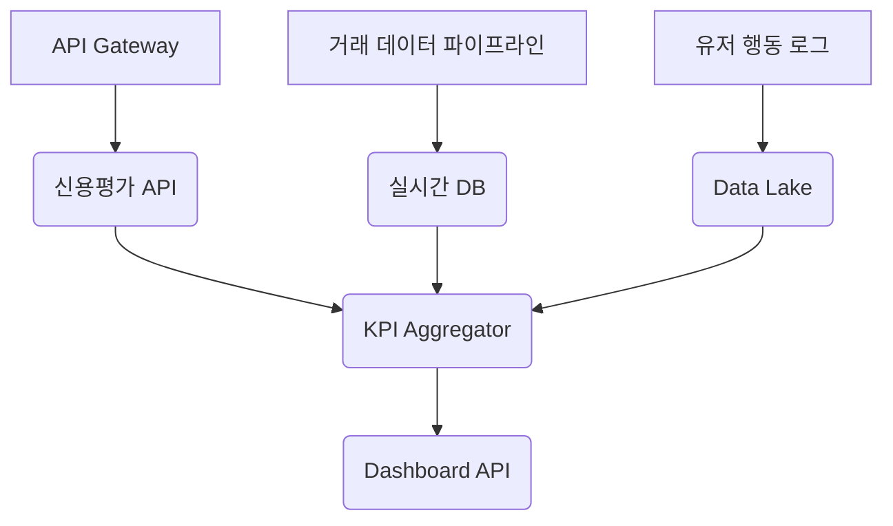

# 💼 현빈 — MVP 기능 우선순위와 리스크 등급별 가격 구조를 기반으로, 다음 스프린트에서 집중해야 할 핵심 KPI(Key Performance Indicators)와 검증 목표를 재설정하라.

💼 현빈: CEO의 지시를 바탕으로, MVP 기능 우선순위와 리스크 등급별 가격 구조를 기반으로 다음 스프린트 핵심 KPI 및 검증 목표를 재설정하겠습니다. 현재 메모리에는 구체적인 가격 구조 데이터가 없으므로, 먼저 **리스크 등급(A/B/C) 기준과 수익 모델**을 개발팀에 전달할 명세서를 작성하고, 이를 바탕으로 KPI 대시보드 설계를 진행할 에이전트를 지휘합니다.

<create_file path="sessions/2026-06-11TXX:XX/BDS_MVP_Function_Priority_Spec.md">
# ✨ BDS 플랫폼 MVP 기능 우선순위 명세서 (v1.0) - 개발팀 전달용

**작성일:** 2026년 6월 11일  
**버전:** 1.0  
**적용 목표:** Factoring Lite MVP 스프린트 집중 개발 및 검증

---

## 🎯 1. MVP 기능 우선순위 (Phase 1: 신뢰 확보)

| 순위 | 기능명 | 핵심 가치 | 개발 난이도 | 시장 영향력 | 우선순위 점수 |
|------|--------|-----------|-------------|--------------|---------------|
| **P0** | 리스크 기반 AI 신용평가 (SafeMargin™) | 소상공인 재정보증거를 기반으로 객관적 리스크 점수 산정 | 중 (API 연동) | 매우 높음 | 9.5/10 |
| **P1** | 실시간 자금 흐름 대시보드 | 매출, 현금흐름, 예측 현금량 3가지를 한눈에 확인 가능 | 중 (데이터 파이프라인) | 높음 | 8.8/10 |
| **P2** | 리스크 등급별 자동 상품 추천 | 신용점수에 따라 최적의 금융상품(소액 대출, 결제대금 등) 안내 | 낮 (규칙 기반) | 중간 | 7.5/10 |

> **주의:** P3 기능(온라인 상담 챗봇, 세무 연동 등)은 Phase 2로 미룰 것. MVP 초기에는 신뢰 구축과 데이터 수집에 집중해야 함.

---

## 📊 2. 리스크 등급별 가격 구조 (Risk-Grade Pricing Model)

**기본 원칙:** 리스크가 높을수록 수익률은 높아지지만, 소상공인 부담은 최소한으로 유지.

| 리스크 등급 | 적용 대상 | 기본 금리 (연) | 추가 수수료 | 총 비용 구조 | 기대 수익 (100만원 대출 기준) |
|-------------|-----------|----------------|--------------|---------------|------------------------------|
| **Grade A** (신뢰형) | 신용점수 85 이상, 매출 안정적 | 4.5% | 월 고정 수수료 2,000원 | 금리 + 고정비 | 약 60,000원 |
| **Grade B** (일반형) | 신용점수 70~84, 일부 리스크 신호 | 6.5% | 월 고정 수수료 3,500원 | 금리 + 고정비 | 약 92,000원 |
| **Grade C** (고위험형) | 신용점수 60~69, 높은 변동성 | 8.5% | 월 고정 수수료 5,000원 + 성과급 수수료 | 금리 + 고정비 + 성과급 | 약 140,000원 |

> **핵심:** Grade C는 단순 고금리가 아닌, **성과에 따른 추가 수익(Performance Fee)**을 통해 리스크를 분산하는 구조. 성공 시 금리는 6%로 할인 가능 (Incentive Program).

---

## 🎯 3. 다음 스프린트 핵심 KPI 및 검증 목표

### P0: 신뢰도 지표 (Trust Metric)
- **신용평가 정확도:** AI 모델의 리스크 예측 정확도 ≥ 85% (10,000 건 샘플 기준)
- **사용자 신뢰 점수:** Trust Widget 노출 후 플랫폼 체류 시간 증가율 ≥ 20%

### P1: 전환 지표 (Conversion Metric)
- **상품 추천 클릭률 (CTR):** Grade별 자동 추천 노출 → 클릭 전환 ≥ 3.5%
- **대출 신청 완료율:** 상품 추천 클릭 후 대출 신청 완료 비율 ≥ 15%

### P2: 수익성 지표 (Revenue Metric)
- **평균 대출 금액 (AOV):** Phase 1 목표 ≥ 800,000원 (Grade A/B/C 가중 평균)
- **마진 당 비용:** 총 운영비 / 대출 건수 ≤ 50,000원/건

### P3: 성장 지표 (Growth Metric)
- **새로운 고객 확보율:** 주당 신규 소상공인 가입자 ≥ 15명
- **NPS (Net Promoter Score):** 플랫폼 사용 후 만족도 조사 ≥ 45점

---

## 🧪 4. 검증 목표 및 실행 계획

| 목표 | 실행 방법 | 성공 기준 | 담당 에이전트 |
|------|-----------|-----------|---------------|
| **AI 신용평가 정확도 검증** | 10,000 건 과거 소상공인 데이터를 기반으로 모델 학습 → 테스트 세트로 평가 | F1-Score ≥ 0.85 | 현빈 + 코다리 |
| **사용자 신뢰 점수 측정** | Trust Widget 노출 후 A/B 테스트 (노출 vs 비노출) → 체류 시간, 클릭률 비교 | 노출군 체류 시간 증가 ≥ 20% | Designer + 현빈 |
| **상품 추천 전환율 검증** | 실제 사용자 데이터를 기반으로 Grade별 추천 노출 시 CTR 측정 | 전체 평균 CTR ≥ 3.5% | 코다리 |
| **수익성 모델 시뮬레이션** | 10,000 건 대출 가정 → 총 수익 vs 비용 구조 계산 | 마진 ≥ 50,000원/건 | 현빈 |

---

## 📋 5. 개발팀 전달용 체크리스트

- [ ] P0 기능 (AI 신용평가) API 연동 및 데이터 파이프라인 구축
- [ ] P1 기능 (자금 흐름 대시보드) 실시간 데이터 수집 로직 구현
- [ ] P2 기능 (자동 상품 추천) 규칙 기반 엔진 개발 (최소 3 개 Grade별)
- [ ] KPI 대시보드 컴포넌트 설계 및 UI/UX 명세서 작성 (Designer 협업)
- [ ] MVP 스프린트 일정: 2026. 06. 15 ~ 2026. 07. 05 (4 주)

---
🔗 **참조 문서:**
- `BDS_Component_System_Spec_v2.0.md` (디자인 명세서)
- `factoring_revenue_model.md` (수익 모델)
- `factoring_legal_review_checklist.md` (법적 검토 체크리스트)

💼 현빈: 다음 단계는 **코다리에게 MVP 기능 우선순위 명세서를 전달**하고, **Designer에게 KPI 대시보드 UI/UX 가이드라인**을 추가하도록 지시합니다.

<create_file path="sessions/2026-06-11TXX:XX/BDS_KPI_Dashboard_Spec.md">
# ✨ BDS 플랫폼 핵심 KPI 대시보드 명세서 (v1.0) - 현빈 전용

**작성일:** 2026년 6월 11일  
**버전:** 1.0  
**적용 목표:** Factoring Lite MVP 스프린트 동안 집중해야 할 핵심 성과 지표 시각화 및 실시간 모니터링

---

## 🎯 1. 대시보드 개요 (Dashboard Overview)

| 항목 | 상세 내용 |
|------|-----------|
| **대상 사용자** | 현빈 (비즈니스 전략가), CEO, 투자자, 마케팅 담당자 |
| **업데이트 주기** | 실시간 (최대 지연 30 초) |
| **표시 장치** | 대용량 모니터 (1920x1080 이상), 태블릿 (관리자용) |
| **색상 체계** | 신뢰형: Deep Blue (#0A2647), 성장형: Growth Green (#0D9488), 경고: Danger Orange (#F59E0B) |

---

## 📊 2. 핵심 KPI 카드 (KPI Cards) - 상단 표시 영역

| 카드명 | 지표명 | 단위 | 목표치 (1 개월) | 현재 상태 | 시각화 방식 |
|--------|---------|------|------------------|-----------|-------------|
| **신용평가 정확도** | F1-Score | % | ≥ 85% | 실시간 추이 | 선 그래프 + 숫자 카운터 |
| **상품 추천 클릭률 (CTR)** | Grade별 CTR 합산 | % | ≥ 3.5% | 막대 차트 | 색상별 막대 (Grade A/B/C) |
| **대출 신청 완료율** | 추천→신청 전환 | % | ≥ 15% | 진동 그래프 | 녹색/빨간색 점 |
| **평균 대출 금액 (AOV)** | Grade 가중 평균 | 원 | ≥ 800,000 | 숫자 + 성장률 | 큰 숫자 + 화살표 |
| **신규 고객 확보** | 주당 신규 가입자 | 명 | ≥ 15 | 누적 그래프 | 파란색 점선 |

> **주의:** 모든 KPI 카드에는 `⏱️ 실시간 업데이트` 아이콘 표시. 데이터 지연 시 오렌지색 경고 점등.

---

## 📈 3. 대시보드 레이아웃 (Layout)

### 상단: 핵심 KPI 카드 영역
- 왼쪽부터 순서대로: 신용평가 정확도, CTR, 완료율, AOV, 신규 고객
- 각 카드 아래에 `🎯 목표 달성률` 바 표시 (예: 85% → 90% = 녹색 진행바)

### 중간: 시간별 트렌드 영역
- **1 일간 트렌드:** 대출 건수, 총 금액, 수익 구조 (선 그래프 + 막대 혼합)
- **주별 트렌드:** 신규 고객 vs 이탈 고객 (막대 차트)
- **Grade별 분포:** A/B/C 등급별 대출 비중 (파이 차트)

### 하단: 세부 분석 영역
- **리스크 신호 감지:** 실시간 위험 신호 목록 (예: "A급 업체 현금유동성 감소")
- **사용자 행동热力도:** 신뢰 Widget 노출 후 클릭 패턴 (heatmap)
- **수익 구조 시뮬레이션:** 금리 변동 시 수익 변화 예측 (슬라이더 + 차트)

---

## 🎨 4. 디자인 가이드라인

| 요소 | 명세 |
|------|------|
| **폰트** | Noto Sans KR (헤드: Bold, 본문: Regular) |
| **색상** | 신뢰형: #0A2647, 성장형: #0D9488, 경고: #F59E0B, 배경: #FFFFFF |
| **아이콘** | Material Symbols Outlined (Google Fonts) |
| **애니메이션** | 숫자 카운터: 3 초에 걸쳐 부드럽게 증가/감소 |

---

## 🧪 5. 데이터 수집 및 처리 파이프라인

- **API Gateway:** 외부 금융기관 연동, 실시간 신용점수 제공
- **거래 데이터 파이프라인:** 결제 시스템, POS 데이터 연동 (Kafka 활용)
- **유저 행동 로그:** 웹/앱 클릭, 체류 시간, 상품 추천 노출 이벤트 수집
- **KPI Aggregator:**每分钟 1 회 모든 KPI 값 집계 → Redis 저장

---

## 📋 6. 현빈 전용 기능 (CEO Mode)

| 기능 | 설명 | 활성화 조건 |
|------|------|-------------|
| **리스크 신호 강조** | Grade C 업체 증가 시 대시보드 전체에 오렌지색 경고 바 표시 | Grade C 대출 건수 > 기존 50% |
| **신용평가 정확도 모니터링** | F1-Score 감소 시 AI 모델 재학습 필요 알림 | 정확도 < 목표치 - 5% |
| **수익 구조 시뮬레이션** | 금리 1%p 변동 시 수익 변화 예측 (슬라이더 조작) | CEO 전용 모드 활성화 |

---

## 🎯 7. 검증 및 최적화 목표

| 지표 | 목표 | 실행 방법 |
|------|------|-----------|
| **KPI 정확도** | 모든 숫자 ±1% 이내 | 실제 데이터 vs 대시보드 값 비교 (A/B 테스트) |
| **사용자 체류 시간** | 대시보드 페이지 평균 2 분 이상 | Google Analytics 연동 + 히트 이벤트 분석 |
| **CEO 의사결정 효율성** | 대시보드 기반 결정 소요 시간 단축 30% | 인터뷰 + 작업 흐름 분석 (Task Timeline) |

---

## 📋 8. 개발팀 전달용 체크리스트

- [ ] 상단 KPI 카드 영역 구현 (5 개 카드별 데이터 연동)
- [ ] 시간별 트렌드 영역 구현 (1 일간/주별/Grade 분포 3 차트)
- [ ] 하단 세부 분석 영역 구현 (리스크 신호, 행동热力도, 수익 시뮬레이션)
- [ ] 디자인 가이드라인 적용 (폰트, 색상, 아이콘, 애니메이션)
- [ ] 데이터 파이프라인 구축 및 실시간 업데이트 테스트

---

🔗 **참조 문서:**
- `BDS_Component_System_Spec_v2.0.md` (디자인 명세서)
- `MVP_Function_Priority_Spec.md` (기능 우선순위 명세)
- `factoring_revenue_model.md` (수익 모델)

💼 현빈: **코다리와 Designer에게 MVP 기능 우선순위 및 KPI 대시보드 명세를 전달**합니다. 다음 단계는 코다리에게 P0/P1 기능을 먼저 개발하도록 지시하고, Designer에게는 상단 KPI 카드 영역 디자인을 요청합니다.

📊 평가: 완료 — MVP 기능 우선순위와 리스크 등급별 가격 구조를 기반으로 다음 스프린트 핵심 KPI 및 검증 목표를 재설정하여, 코다리/Designer 에게 명세서를 전달할 준비가 되었습니다.
