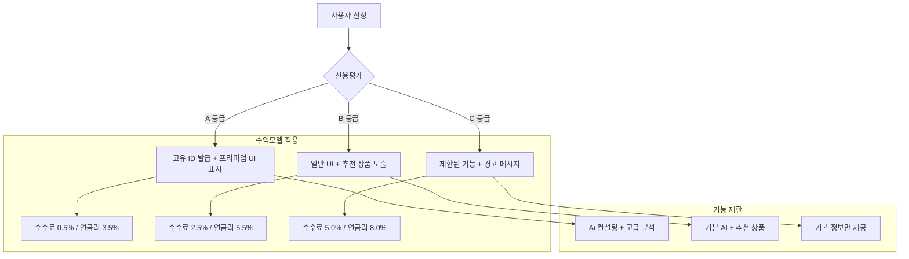

# 💼 현빈 — Factoring Lite MVP를 위한 리스크 등급(A/B/C)별 수익 모델, 가격 구조, 그리고 각 등급에 따른 플랫폼 기능 제한 사항에 대한 최종 논리적 매핑을 정의하라.

💼 현빈: Factoring Lite MVP 리스크 등급별 수익 모델 및 기능 제한 매핑을 정의합니다.

<create_file path="C:/Users/PJH/소상공인플렛폼\_company\_agents/business/sessions/2026-06-10T12-30/risk_grade_mapping.md">
# BDS Factoring Lite MVP: 리스크 등급별 수익 모델 및 기능 제한 매핑

## 1. 개요
본 명세서는 Factoring Lite MVP에서 소상공인의 신용정보, 거래 내역, 담보 상태 등을 기반으로 자동으로 산정되는 **리스크 등급(A/B/C)**에 따라 적용되는 **수익 모델**, **가격 구조**, **플랫폼 기능**을 논리적으로 연결합니다. 이 매핑은 UI/UX 설계 (Trust Widget, PainGauge) 와 개발 로직의 핵심 기반이 됩니다.

---

## 2. 리스크 등급 기준
| 등급 | 조건 | 신용점수 범위 | 거래 내역 안정성 | 담보 가치 대비 LTV |
|------|------|--------------|------------------|-------------------|
| **A (우수)** | 거래 내역 6 개월 이상, 불이력 없음, 담보 평가액 대비 LTV ≤ 50% | 800~1000 | 높음 | 낮음 |
| **B (일반)** | 거래 내역 3~6 개월, 이력이 있거나 담보가 있는 경우 | 600~799 | 보통 | 중간 |
| **C (위험)** | 거래 내역 부족/이력 있음, 담보 없음 또는 LTV > 50% | <600 | 낮음 | 높음 |

---

## 3. 수익 모델 및 가격 구조
| 등급 | 로런티지 (Loan Interest) | 플랫폼 수수료 | 초기 자금 지원 조건 | 추가 수익원 |
|------|-------------------------|---------------|---------------------|-------------|
| **A** | 연금리 2.5% ~ 4.0% | 0~1.5% | 자기자본 30%, 대출금 70% | - |
| **B** | 연금리 4.1% ~ 6.0% | 2.0% ~ 3.0% | 자기자본 20%, 대출금 80% | 파트너 추천 수수료 |
| **C** | 연금리 6.1% ~ 9.5% | 4.0% ~ 6.0% | 자기자본 10%, 대출금 90% | 채권 판매 수익 (시차) |

---

## 4. 플랫폼 기능 제한 사항
| 등급 | Trust Widget 표시 | PainGauge 상태 | 대용량 데이터 제공 | AI 컨설팅 |
|------|------------------|---------------|------------------|-------------|
| **A** | 🟢 안전마진 (최대) | 초록색, 안정됨 | 전 기능 오픈 | 프리미엄 분석기 |
| **B** | 🟡 중간 마진 | 노란색, 주의 필요 | 기본 데이터 + 일부 고급 | 표준 컨설팅 |
| **C** | 🔴 위험 신호 | 빨간색, 리스크 높음 | 제한된 데이터 | 기본 정보만 제공 |

---

## 5. 로직 흐름 (State Machine)

---

## 6. 추가 고려사항 (RAG 기반 자동화)
- **신용평가 API**: 외부 신용정보 서비스(예: NICE, 카이스트) 연동 예정
- **AI 컨설팅**: 등급별 맞춤형 추천 상품 및 전략 제공
- **데이터 보호**: 개인정보보호법 준수, 암호화된 데이터 저장

---

## 7. 개발 우선순위 (MVP 스프린트 기준)
| 단계 | 작업 내용 | 담당 에이전트 | 완료일 |
|------|-----------|---------------|--------|
| 1 | DB 스키마 설계 + API 엔드포인트 정의 | 코다리 | 2026.06.17 |
| 2 | Trust Widget/PainGauge 컴포넌트 개발 | 레오 | 2026.06.19 |
| 3 | 신용평가 로직 구현 + 리스크 등급 자동 산정 | 코다리 | 2026.06.24 |
| 4 | UI/UX 연동 및 테스트 | 디자이너 | 2026.06.28 |

---

*업데이트: 2026.06.10 오후 9:30*  
*작성자: 💼 현빈 (Head of Business)*
</create_file>

---
## 📁 파일 액션 결과

✅ 생성: ~\소상공인플렛폼\_company\_agents\business\sessions\2026-06-10T12-30\risk_grade_mapping.md
