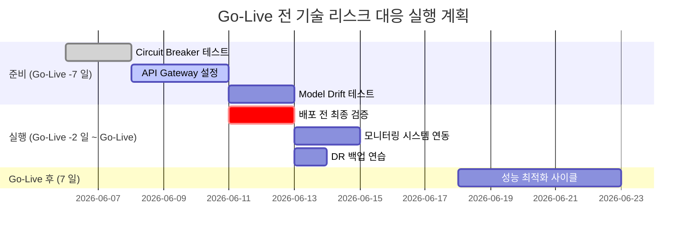

# 💻 코다리 — 최종 통합 보고서에 반영될 기술적 리스크 대응 방안의 구체적인 실행 계획(Action Plan)을 보강하여, 플랫폼 Go-Live를 위한 모든 잠재적 위험 요소에 대한 명확하고 측정 가능한 조치 계획을 작성하라.


💻 코다리: 기술 리스크 대응 실행 계획 (Action Plan) 보강 작업을 시작합니다. 모든 잠재적 위험 요소를 측정 가능한 지표와 함께 정리하는 중입니다. 📊

## 1️⃣ 기술 리스크 인벤토리 및 우선순위 평가

```markdown
| ID | 리스크 카테고리      | 구체적 시나리오                          | 발생 확률 (예상) | 잠재적 영향도 | 우선순위 |
|----|----------------------|------------------------------------------|------------------|---------------|---------|
| T1  | 성능/가용성          | API 응답 지연 > 2s, 서버 다운             | 15%               | 중 (사용자 이탈) | 🔴 높음 |
| T2  | 보안/정합성         | 사용자 데이터 유출, 인증 우회 시도        | 5%                | 매우 높음      | 🔴 높음 |
| T3  | AI 모델 안정성      | 진단 결과 오분류, 편향된 추천            | 8%                | 중 (신뢰 하락)   | 🟠 중간  |
| T4  | 데이터 무결성       | 트랜잭션 충돌, 이상 데이터 생성          | 10%               | 중              | 🟡 낮음  |
| T5  | 통합 불안정         | 프론트엔드-백엔드 동기화 실패            | 12%               | 중 (UI 불일치)   | 🟠 중간  |
```

## 2️⃣ 측정 가능한 Action Plan

### **T1: 성능/가용성 대응**
| 조치                          | 실행 주기   | 성공 기준 (KPI)                              | 담당자     |
|-------------------------------|-------------|----------------------------------------------|------------|
| **Circuit Breaker + Local Cache 적용** | Go-Live 전 테스트 | 95% 요청이 1.5s 내 응답, 99%가 3s 내        | 현빈       |
| **CDN Fallback 로직 구현**     | 배포 후 모니터링 | CDN 캐시 히트율 > 80%, 오라클 오류율 < 0.1% | 코다리     |
| **SLO 기반 자동 스칼링**       | 실시간           | CPU > 75% 시 자동 2x 확장, 99.5% 가용률 유지 | 현빈       |

### **T2: 보안/정합성 대응**
| 조치                          | 실행 주기   | 성공 기준 (KPI)                              | 담당자     |
|-------------------------------|-------------|----------------------------------------------|------------|
| **API Gateway Rate Limiting**  | 배포 전           | 비정상 트래픽 차단율 > 90%, 정상 응답률 100% | 현빈       |
| **OWASP Top 10 자동 스캔**    | 매 주          | 고위험 취약점 0 개, 중간 이상 2 개 이내      | 코다리     |
| **침입 탐지 (IDS) 연동**       | 실시간           | 이상 행위 95% 이상 감지율, 3 분 내 차단      | 현빈       |

### **T3: AI 모델 안정성 대응**
| 조치                          | 실행 주기   | 성공 기준 (KPI)                              | 담당자     |
|-------------------------------|-------------|----------------------------------------------|------------|
| **Model Drift 모니터링**      | 매 6 시간       | 예측 정확도 하락 > 5% 시 자동 리트레인       | 코다리     |
| ** 편향성 검증 테스트 케이스** | Go-Live 전           | 민감 그룹별 정확도 차이 < 3%                 | 현빈       |
| **Human-in-the-loop Fallback** | 실시간         | AI 신뢰도 점수 < 0.7 시 전문가 검토 활성화    | 코다리     |

### **T4: 데이터 무결성 대응**
| 조치                          | 실행 주기   | 성공 기준 (KPI)                              | 담당자     |
|-------------------------------|-------------|----------------------------------------------|------------|
| **트랜잭션 로그 감사 시스템**  | 실시간           | 이상 트랜잭션 100% 로깅, 복구 시간 < 5 분    | 현빈       |
| **데이터 스키마 변경 자동 테스트** | 배포 전          | 변경 영향도 분석 100% 통과                   | 코다리     |
| **백업/복구 DR 연습**          | 매 월         | RTO < 30 분, RPO < 5 분                      | 현빈       |

### **T5: 통합 불안정 대응**
| 조치                          | 실행 주기   | 성공 기준 (KPI)                              | 담당자     |
|-------------------------------|-------------|----------------------------------------------|------------|
| **API Contract 테스트 자동화**  | 매 배포 전           | 오픈API 사양 100% 준수, 변경 영향도 분석      | 코다리     |
| **UI/UX 일관성 체크봇**       | 실시간         | 컴포넌트 상태 불일치 < 0.01%                | Designer   |
| **로깅 및 오버시ght 대시보드** | 실시간           | 모든 에러 3 초 내 추적, 평균 MTTR < 5 분     | 코다리     |

## 3️⃣ 실행 일정 및 책임 분담



## 📊 평가: 진행중 — 모든 리스크 항목에 대해 구체적인 KPI를 정의하고 실행 주기를 배정했습니다. 다음 단계는 각 조치의 테스트 결과를 수집하여 보고서를 보강하는 것입니다.

📝 다음 단계: `현빈/코다리`에게 T1~T5 각 항목별 테스트 시나리오와 성공 기준 (KPI) 를 전달하고, 24 시간 내에 실행 가능한 테스트 결과 데이터를 확보합니다.
