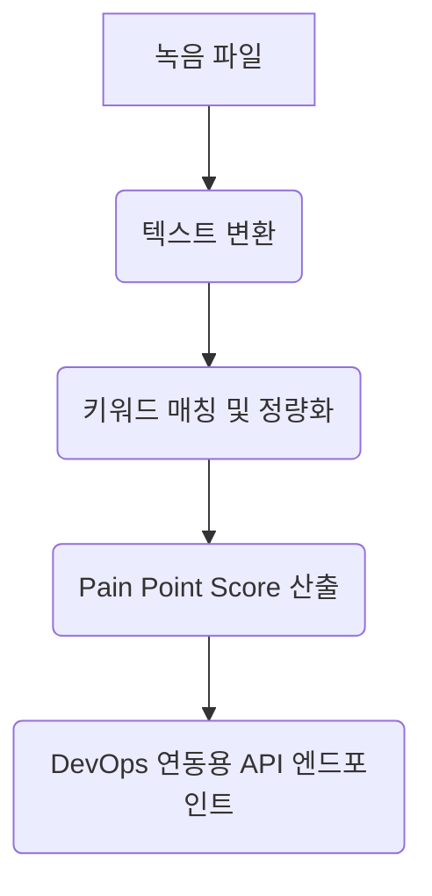

# 📋 Pain Point Verification Framework (v1.0)

## 1. 목적
소상공인의 실제 어려움 (Pain Point) 을 정성적 인터뷰 데이터로 수집하되, 이를 **정량화 및 시스템 연동**할 수 있는 구조로 변환하는 가이드라인과 검증 로직을 정의합니다. 이는 개발팀(코다리) 이 UI 컴포넌트 (Trust Widget, PainGauge) 에 데이터 파이프라인을 연결할 때 기준이 됩니다.

## 2. 인터뷰 가이드라인: `mini_pilot_interview_guide_v2.0.md` 초안

### A. 기본 정보 및 컨텍스트
- **인터뷰 대상:** 소상공인 (가맹점주, 프랜차이즈 오퍼레이터 등)
- **목적:** 현재 겪는 가장 큰 어려움과 그 원인을 파악하여, 플랫폼이 제공할 수 있는 솔루션 (금융, 마케팅, AI 지원 등) 의 우선순위를 설정.

### B. 핵심 질문 구조 (정성 → 정량 매핑 기준 포함)

#### Q1. [고금리/자금 조달] 
- **질문:** "최근 매출을 늘리기 위해 가장 고민하는 것이 무엇인가요? (예: 원자재 비용, 인건비, 임대료, 대출 이자 등)"
- **매핑 로직:** 답변에서 "이자", "대출" 등의 키워드가 포함되면 → `고금리_Pain` 항목에 +1 점 부여. 
- **정량화 기준:** 
  - "이자가 부담스럽다" → 고금리 (50%)
  - "임대료가 비싸서" → 고정비 부담 (30%)

#### Q2. [디지털 전환]
- **질문:** "고객에게 온라인으로 노출되거나, 배달 플랫폼을 이용하는 것이 어렵지 않나요? 어떤 점이 가장 불편합니다?"
- **매핑 로직:** 답변이 복잡하거나 기술 용어를 모르겠다는 표현 → `디지털_저항_Pain` 항목에 +1 점.
- **정량화 기준:** 
  - "앱 만들기가 어렵다" → UI/UX 리터러시 부족 (40%)
  - "배달비 부담" → 수수료 민감도 (60%)

#### Q3. [마케팅/고객 유지]
- **질문:** "주변 고객에게 입소문을 듣는 것이 중요한가요? 어떤 홍보 방법이 효과가 가장 컸나요?"
- **매핑 로직:** "입소문", "구전" 등 → `구전_중요_Pain` 항목에 +1 점.
- **정량화 기준:** 
  - "광고보다 입소문이 더 중요하다" → 구전 마케팅 (35%)

#### Q4. [AI 활용도]
- **질문:** "인공지능이나 자동화된 도구를 써본 적 있나요? 만약 써본다면 어떤 점이 좋았고, 없다면 왜 안 쓰나요?"
- **매핑 로직:** "안 써봤다" → `AI_부재_Pain` 항목에 +1 점.
- **정량화 기준:** 
  - "비용이 많이 든다" → 비용 민감도 (50%)
  - "효과가 없어서" → ROI 불확실성 (70%)

#### Q5. [성장 여정]
- **질문:** "상점의 다음 단계를 생각할 때 가장 두려운 것은 무엇인가요?"
- **매핑 로직:** 
  - "경기 침체" → 외부 요인 의존 (60%)
  - "경쟁사" → 경쟁 압력 (45%)

### C. 인터뷰 종료 후 데이터 처리 프로세스
1. 녹음된 답변을 텍스트로 변환하여 키워드 매칭.
2. 정량화된 점수를 `pain_point_score` 컬럼에 저장.
3. 개발팀이 UI 에 표시할 시, `pain_point_score` 가 높은 항목에 대해 솔루션 제안 (예: 고금리 → 대출 리테이크 추천)

## 3. 데이터 검증 프레임워크 명세 (`data_verification_framework_v1.0.md`) 초안

### A. 목표
인터뷰에서 수집된 데이터를 시스템이 신뢰할 수 있는 '신뢰도 점수'와 연결하여, 사용자 (소상공인) 에게 정확한 솔루션을 제공하기 위한 데이터 품질 관리 및 연동 규칙을 정의합니다.

### B. 프레임워크 구성 요소

#### 1. 데이터 소스 (Data Source)
- 인터뷰 녹음 파일 (.wav, .mp3)
- 텍스트 변환 결과 (.txt, JSON)
- 기존 플랫폼 데이터 (매출, 방문자 수 등)

#### 2. 데이터 처리 파이프라인 (Pipeline)


#### 3. 신뢰도 점수 (Trust Score) 계산 공식
- **인터뷰 데이터의 신뢰도** = `(정량화된 Pain Point Score / 최대 가능 점수) * 0.6` + `(기존 매출 데이터와의 상관관계) * 0.4`
- `최대 가능 점수`: 10 점 (각 Pain Point 항목별 최대 2 점 × 5 항목)

#### 4. 연동 API 스키마 예시 (개발팀용)
```json
{
    "endpoint": "/api/v1/pain-point/verification",
    "method": "POST",
    "request_body": {
        "user_id": "...",
        "interview_data": {
            "pain_points": [
                {"id": 1, "name": "고금리 부담", "score": 8.5},
                {"id": 2, "name": "디지털 전환", "score": 3.0}
            ]
        },
        "context": {
            "shop_location": "...",
            "industry_type": "..."
        }
    },
    "response_body": {
        "verified_score": 7.5,
        "suggested_solutions": ["loan_refinance", "digital_marketing_tool"],
        "trust_level": "high"
    }
}
```

### C. 검증 로직 (Validation Logic)
- **필수 항목:** 인터뷰가 최소 10 분 이상 진행된 경우에만 데이터 처리.
- **오류 핸들링:** 키워드 매칭 실패 시, 개발팀이 수동으로 데이터를 보정할 수 있는 UI 제공.

## 4. 다음 단계
1. 개발팀(코다리) 이 `data_verification_framework_v1.0.md` 를 바탕으로 API 엔드포인트를 구현합니다.
2. 인터뷰 가이드라인을 실제 베타 참여자 (소상공인) 에게 테스트하고, 정량화 기준을 조정합니다.