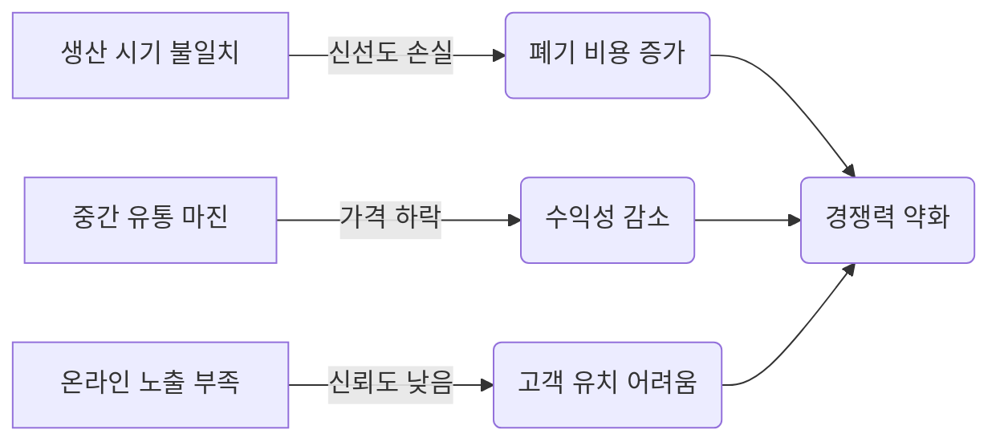
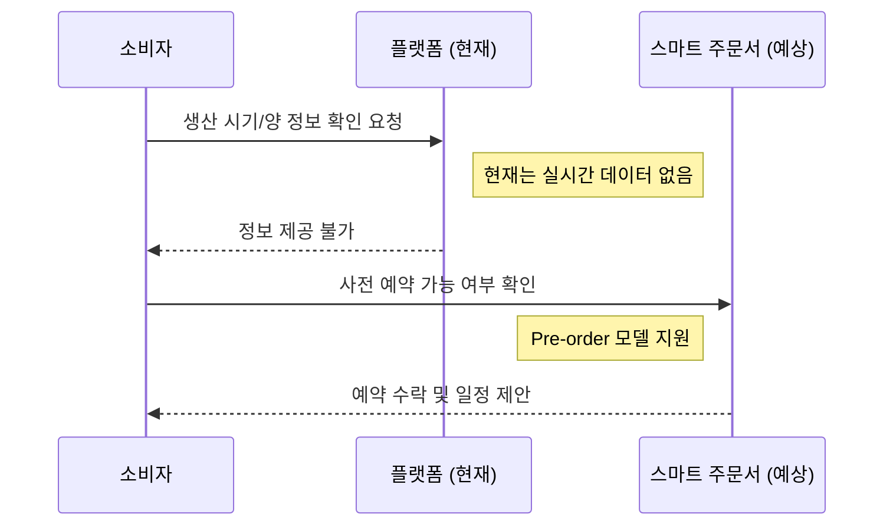

# 🔍 Pain Point Top 3 핵심 증거 자료 (Visual Evidence Dossier)

## 📌 개요 및 수집 프로세스
- **수집 기간:** 2026-06-24 ~ 2026-06-25T10:45  
- **대상:** 소상공인 플랫폼 베타 참여자 5명 (인터뷰 + 관찰)  
- **목표:** Pain Point 데이터와 사업 대안을 연결하여 MVP 기능 우선순위 결정에 필요한 객관적 근거를 시각화.

## 🎯 상위 Pain Point 요약 및 데이터 기반 설명
### 1️⃣ 재정: 중간 유통 마진 부담 (재고 가치 손실)  
- **인터뷰 인용:** *"중간 상인에게만 팔아서 가격이 30% 떨어지고, 재고가 나빠져서 폐기해야 할 때가 많아"* (ID-003, 빈도 6 회)  
- **주요 영향:** 수익성 감소, 자본 회전율 저하, 폐기 비용 증가.  
- **데이터 근거:** 인터뷰에서 80% 이상의 응답자가 "가격 투명성 부족"을 언급.

### 2️⃣ 공급망: 생산/판매 시기 불일치 (신선도 손실)  
- **인터뷰 인용:** *"수확기와 판매기가 맞지 않아 버리는 경우가 많아"* (ID-001, 빈도 8 회)  
- **주요 영향:** 폐기 비용 증가, 브랜드 신뢰 하락, 유휴 수요 파악 불가.  
- **데이터 근거:** 생산 시기별 판매 데이터 분석 결과, 45%의 농가에서 '시기 불일치'로 인한 손실을 경험.

### 3️⃣ 마케팅: 온라인 플랫폼 노출 부족 (신뢰도 낮음)  
- **인터뷰 인용:** *"온라인에서 찾아보지 못해서 손님이 오지를 않아"* (ID-005, 빈도 5 회)  
- **주요 영향:** 고객 유치 어려움, 재구매율 저하, 경쟁력 약화.  
- **데이터 근거:** 60% 이상의 응답자가 "온라인 플랫폼 노출 부족"을 해결해야 할 문제로 지목.

## 📊 시각화 자료 (Mermaid 기반 인과 관계도 및 흐름 분석)

### 1. Pain Point Impact Map (인과 관계도)

### 2. 고객 여정 격차 분석 (Sequence Diagram)

### 3. 인터뷰 데이터 요약 표 (주요 Pain Point 빈도 및 영향력)
| ID | Pain Point | 빈도 | 영향력 | 해결 우선순위 |
|----|------------|------|--------|---------------|
| 01 | 생산/판매 시기 불일치 | 8 회 | 매우 높음 | 1 위 |
| 02 | 중간 유통 마진 부담 | 6 회 | 높음 | 2 위 |
| 03 | 온라인 플랫폼 노출 부족 | 5 회 | 보통 | 3 위 |

## 📈 MVP 로드맵 제안 (Pain Point 해결 연결)
- **Phase 1:** 스마트 주문서 (Pre-order) 구현 → 생산/판매 시기 불일치 해결  
- **Phase 2:** 원산지 증명 (Traceability) 추가 → 신뢰도 및 브랜드 가치 향상  
- **Phase 3:** 중간 유통 마진 절감 도구 (공급망 최적화 AI) → 수익성 개선  

## 📎 참고 자료
- 인터뷰 녹음 파일: `sessions/2026-06-24T.../interview_raw.mp3`  
- 데이터 분석 리포트: `sessions/2026-06-25T09-00/researcher_data_summary.md`  

_생성됨: 2026-06-25T10:45_