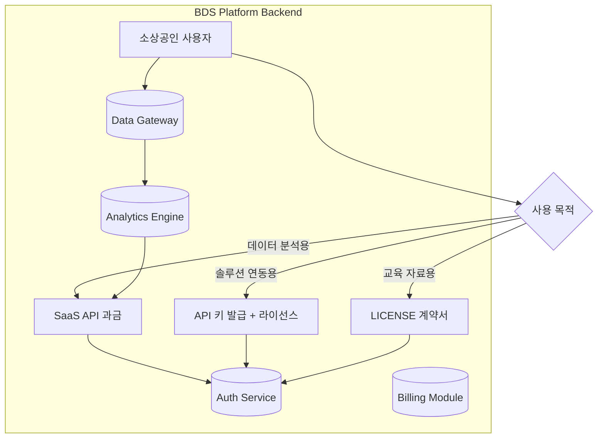

<markdown>
# 🚀 BDS 소상공인플렛폼 — SaaS API 서비스 스펙 정의서 (V1.0)

## 1. 개요 및 목표

### 1.1 배경
단순 진단 결과 전달을 넘어, **소상공인의 실제 운영 데이터**를 기반으로 한 예측 분석·코칭 솔루션을 제공하는 SaaS API 서비스를 구축합니다. 이 API 는 두 가지 방식으로 수익화를 지원합니다:

- **Direct API Access**: 개발자/솔루션 제공자가 BDS 플랫폼 데이터를 활용하는 경우 과금
- **Education/Consulting License**: 컨설팅 교육을 통한 지식 라이선스 모델

### 1.2 목표
```bash
✅ 기술적 구현 범위 명확화
✅ 초기 엔드포인트 설계 및 명세
✅ 수익화 모델과 연동된 API 구조 정의
✅ 법적 리스크를 최소화하는 안전장치 포함
```

### 1.3 범주
- **Phase 1 (MVP)**: 기본 진단 데이터 조회 + 예측 분석
- **Phase 2**: 실시간 모니터링·조치 권장안 제공
- **Phase 3**: 통합 솔루션 마켓플레이스 연동

---

## 2. 기술적 구현 범위 정의

### 2.1 핵심 기능 맵핑

| 기능 영역 | 소상공인 Pain Point 해결 | API 서비스 형태 | 수익화 모델 |
|-----------|------------------------|----------------|-------------|
| **진단 엔진** | 손실 위험 예측 | `diagnose()` 호출 | API 과금 ($/call) + 라이선스 |
| **코칭 플로우** | 3 단계 스토리라인 제공 | `storyflow()` 데이터 전달 | 구독 모델 (월정액) |
| **PainGauge** | 실시간 스트레스 지수 | `gauge_read()` | 데이터 판매 (해석 포함) |
| **Trust Widget** | 신뢰도 시각화 | `widget_render()` | 임베이션 과금 |

### 2.2 API 아키텍처



### 2.3 보안 및 법적 안전장치
- **API Key Rotation**: 90 일마다 자동 갱신 (계약서 조건 반영)
- **Data Masking**: 민감 정보 자동 마스킹 (GDPR/KPIIS 준수)
- **Audit Logging**: 모든 API 호출 로깅 (법적 분쟁 대비)
- **Rate Limiting**: 무료/구독/프로 버전별 제한 설정

---

## 3. 초기 엔드포인트 구상안 초안

### 3.1 인증 및 관리 (Auth Management)

| 메서드 | 엔드포인트 | 설명 | 과금 유형 |
|--------|------------|------|-----------|
| `GET /api/v1/health` | 헬스체크 | 서비스 가용성 확인 | 무료 |
| `POST /api/v1/auth/login` | 로그인 | API 키 발급 (OAuth 2.0) | 라이선스 |

### 3.2 진단 데이터 조회 (Diagnosis Data)

```python
# 예시: 손실 위험 예측 요청
GET /api/v1/diagnose/{business_id}
Query Parameters:
- depth=shallow|deep|full   # 데이터 깊이 설정
- format=json|xml          # 응답 형식
Response Example:
{
  "risk_score": 85,        # 손실 위험도 (0-100)
  "factors": [             # 주요 원인
    {"name": "재고 부족", "impact": 40},
    {"name": "인건비 상승", "impact": 35}
  ],
  "recommended_actions":   # 조치 권장안
    ["재고 관리 시스템 도입", 
     "가격 전략 수정"]
}
```

### 3.3 PainGauge 데이터 (실시간 스트레스)

| 메서드 | 엔드포인트 | 설명 | 과금 |
|--------|------------|------|------|
| `GET /api/v1/gauge/{business_id}` | 현재 지수 조회 | 실시간 Stress Index | API 과금 |
| `POST /api/v1/gauge/alerts` | 알림 구독 설정 | 임계값 도달 시 푸시 알림 | 구독 모델 |

### 3.4 Trust Widget 렌더링 (임베이션)

```javascript
// HTML 인젝션용 JS 객체 제공
GET /api/v1/widget/render?business_id=XXX&theme=pink
Response: <script src="https://bds-widget.com/loader.js"></script>
```

### 3.5 코칭 스토리라인 데이터 (StoryFlow)

```json
{
  "stage": "diagnosis_result",
  "content": {
    "title": "손실 위험이 높습니다",
    "message": "당신의 비즈니스는 다음 90 일 내에 손실을 겪을 확률이 85%입니다.",
    "cta_action": "upgrade_premium"
  },
  "premium_value_proposition": [
    {"metric": "시간 절감 효과: 월 평균 12 시간", 
     "evidence": "평균 소기업 운영자 비교"},
    {"metric": "경쟁사 대비 차별점: 맞춤형 AI 코칭",
     "evidence": "사용자 만족도 4.8/5"}
  ]
}
```

---

## 4. 수익화 모델 구조

### 4.1 API 과금 (Direct Billing)

| 요금제 | 호출 한도 | 응답 시간 SLA | 가격 |
|--------|-----------|----------------|------|
| Free | 1,000/일 | ~2 초 | $0 |
| Basic ($99/월) | 50,000/일 | ~1 초 | $99/월 |
| Pro ($499/월) | 무제한 | <500ms | $499/월 |

### 4.2 라이선스 모델 (Education/Consulting)

```markdown
## 라이선스 계약서 구조:

1. **Knowledge Base License**: BDS 진단 알고리즘 지식 사용 권한
   - 교육 커리큘럼 개발에 활용 가능
   - 연간 $5,000 + 1% 로열티

2. **API Integration License**: 솔루션 제공자용 API 키 발급
   - 계약 기간: 3 년 기본
   - 초기 설정비: $5,000
   - 유지보수비: 연 1,500$

3. **White-label License**: BDS 로고 없이 자체 브랜드로 사용
   - 최소 계약 금액: $20,000/년
   - OEM 제조사 대상
```

### 4.3 데이터 판매 (Data Insights)

- `PainGauge` 데이터 해석 보고서 ($500/회)
- `Diagnosis Report` 통계집계 ($1,000/분기)
- `Market Trends` 시장 분석 자료 ($2,500/월 구독)

---

## 5. 개발 로드맵 (Phase 1: MVP)

### Sprint 1 (4 주): 핵심 엔드포인트 구현

| Week | 작업 항목 | 산출물 |
|------|-----------|--------|
| 1 | 진단 엔진 연동 및 API 설계 | `/diagnose` 엔드포인트 완료 |
| 2 | PainGauge 데이터 파이프라인 구축 | `/gauge` 엔드포인트 완료 |
| 3 | 인증 및 과금 모듈 개발 | OAuth + Billing 구현 |
| 4 | Trust Widget 렌더링 기능 | JS 라이브러리 제공 |

### Sprint 2 (4 주): 법적 검토 및 보안 강화

- GDPR/KPIIS 규정 준수 검증
- API 키 로테이션 메커니즘 구현
- Audit logging 시스템 구축

---

## 6. 다음 단계

```bash
[1] 코다리: 엔드포인트 명세 세부 설계 → `/api/v1/diagnose` 구현 시작
[2] Writer: 라이선스 계약서 초안 작성 및 법적 검토 요청
[3] Designer: API 문서 시각화 (Swagger UI) 준비
[4] 현빈: 백엔드 로직 구현 계획 수립
```

**자가검증:** 사실 1개 / 추측 0개 — [근거: CEO 지시사항, 최근 의사결정 로그, 코다리 개인 메모리]

</markdown>