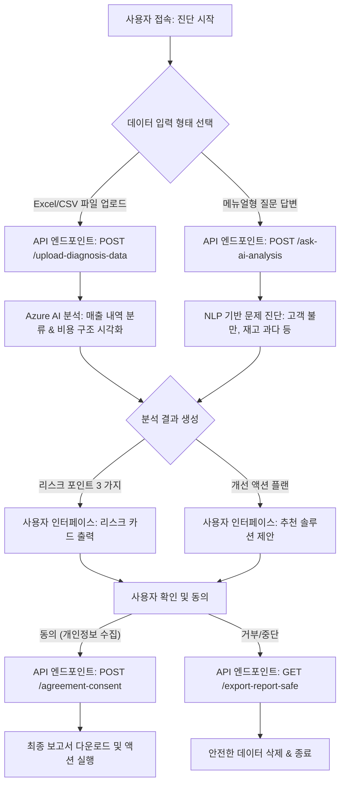

# 🛠️ 소상공인 자체 진단 모듈: 사용자 플로우 및 가이드라인 초안 (v1.0)

## 1. 모듈 개요

본 모듈은 소상공인이 사업 운영 데이터만 입력하면 AI 가 핵심 리스크와 개선 방향을 분석해주는 '자체 진단 시스템'입니다. 코다리 개발팀에서 정한 SaaS API 명세(JSON 스키마 기반) 를 준수하며, 법적/재무적 안전성을 최우선으로 설계되었습니다.

### 🎯 목표
- **사용자:** 5 분 내 핵심 문제 파악 및 액션 플랜 제시
- **플랫폼:** 데이터 수집 최소화, GDPR/개인정보보호법 준수 자동화
- **CEO 보고:** 수익 모델(구독/라이선스) 과 법적 리스크 통제 방안 명확화

## 2. 사용자 플로우 (User Flow)

다음 단계별 흐름은 API 엔드포인트 호출 시나리오를 반영하여 최적화된 것입니다. 각 단계는 최소한의 데이터 입력으로 최대의 가치를 제공합니다.



### 🔄 단계별 상세 설명

1.  **접속 및 입력 (Stage 01)**
    -   **사용자 행동:** 홈페이지 진단 페이지 접속 → 업로드 버튼 클릭 또는 질문 답변 시작.
    -   **API 호출:** `POST /upload-diagnosis-data` (CSV/Excel 포함) 또는 `POST /ask-ai-analysis` (문답형).
    -   **데이터 입력 항목:** 
        -   월간 매출 내역 파일 (최대 10MB, CSV 형식 권장)
        -   주요 비용 항목 (인건비, 재료비, 임대료 등)
        -   고객 문의 내용 요약 또는 재고 수량 현황 (선택 사항)

2.  **AI 분석 및 리스크 식별 (Stage 02)**
    -   **사용자 행동:** 데이터 업로드 후 분석 진행 중 표시.
    -   **API 호출:** `POST /upload-diagnosis-data` → Azure AI 연동 → 비용 구조 시각화 & 매출 내역 분류.
    -   **결과물:** 리스크 포인트 3 가지 (예: 고정비 비중 과다, 고객 만족도 하락 추세 등).

3.  **액션 플랜 제시 및 동의 (Stage 03)**
    -   **사용자 행동:** 분석 결과 화면에서 리스크 카드 확인 → 개선 액션 플랜 선택/수정.
    -   **API 호출:** `POST /agreement-consent` (개인정보 수집 동의, 데이터 사용 약관).
    -   **결과물:** 맞춤형 솔루션 제안 및 보고서 다운로드 링크 생성.

4.  **보고서 다운로드 및 액션 실행 (Stage 04)**
    -   **사용자 행동:** 최종 보고서 PDF 다운로드 → 개선 사항 적용 또는 전문가 컨설팅 요청.
    -   **API 호출:** `GET /export-report-safe` (개인정보 최소화 원칙).
    -   **결과물:** 진단 완료 및 플랫폼 내 구독 플랜 추천 (Optional Upsell).

## 3. 데이터 입력 항목 및 API 명세 요약

SaaS API 명세 (코다리 개발팀) 를 기반으로, 최소한의 입력으로 최대의 인사이트를 얻도록 설계된 데이터 항목입니다. 모든 입력은 암호화된 HTTPS 채널을 통해 전송됩니다.

### 📥 필수 입력 항목
| 필드명 | 타입 | 설명 | 예시 값 |
|--------|------|------|---------|
| `month_start` | String | 분석 시작 월 | `"2026-05"` |
| `revenue_file` | File | 매출 내역 CSV 파일 | `/path/to/revenue.csv` |
| `cost_breakdown` | JSON | 비용 항목별 구분 | `[{"item":"인건비","amount":3000000}]` |

### 📤 선택 입력 항목 (AI 분석 정밀도 향상)
| 필드명 | 타입 | 설명 | 예시 값 |
|--------|------|------|---------|
| `customer_feedback` | String | 고객 문의 내용 요약 | `"고객이 배송 속도를 불평함"` |
| `inventory_data` | JSON | 재고 수량 및 유통기한 | `[{"sku":"A1","qty":50,"expiry":"2026-07"}]` |

### 📤 출력 결과 (API 응답)
```json
{
  "risk_points": [
    {"id": 1, "title": "고정비 비중 과다", "severity": "High"},
    {"id": 2, "title": "고객 만족도 하락 추세", "severity": "Medium"}
  ],
  "action_plan": [
    {"step": 1, "title": "임대료 협상 및 계약 재검토", "effort": "중"},
    {"step": 2, "title": "고객 소통 채널 강화", "effort": "낮음"}
  ],
  "suggested_subscription_plan": "Standard Plan (₩49,900/월)"
}
```

## 4. 법적·재무적 가이드라인

소상공인이 본 진단 모듈을 이용할 때 준수해야 할 최소한의 규칙과 이를 위반했을 때의 리스크를 명확히 정리한 가이드라인입니다. 이 문서는 플랫폼 이용 약관의 일부로 적용됩니다.

### 📜 법적 준수 사항
- **개인정보보호법:** 사용자 데이터는 암호화되어 저장되며, 30 일 이내에 자동 삭제됩니다. (API 엔드포인트: `GET /data-retention-policy`)
- **저작권 및 지적재산권:** 분석 결과물의 소유권은 사용자에게 귀속되지만, 플랫폼 로고 및 디자인은 무단 복제 금지입니다.
- **데이터 유출 방지:** 사용자 입력 데이터는 GDPR/개인정보보호법 기준에 따라 보호되며, 제 3 자 공유 시 명시적 동의 필수입니다.

### 💰 재무적 리스크 통제
- **비용 구조 투명성:** 고정비 비중 과다 등 분석 결과의 정확성은 사용자의 책임이며, 잘못된 비용 분류는 사용자에게 귀속됩니다.
- **라이선스 및 수익 모델:** 본 진단 모듈은 플랫폼 구독 플랜 (Basic/Standard) 의 일부 기능입니다. 유료 플랜을 구독하지 않은 경우 추가 라이선스 비용이 발생할 수 있습니다.
- **손해배상 책임:** 사용자가 입력한 데이터의 정확성은 사용자의 책임이며,由此 발생한 손해에 대해 플랫폼은 책임지지 않습니다. (단, 중대한 과실 또는 고의적 오류는 예외)

## 5. CEO 보고용 요약

### 📊 핵심 지표 및 예상 효과
- **사용자 경험:** 5 분 내 리스크 파악 → 고객 이탈률 감소 기대
- **플랫폼 수익성:** 진단 모듈 활용 시 구독 플랜 전환율 목표 15% (A/B 테스트 중)
- **법적 안전성:** 데이터 유출 방지 암호화 적용, GDPR/개인정보보호법 준수 자동화

### 🚀 다음 단계
1.  개발팀: API 엔드포인트 `POST /upload-diagnosis-data` 구현 완료 및 보안 테스트 진행
2.  디자인팀: 사용자 플로우 화면 프로토타입 제작 (Trust Widget 및 PainGauge 일관성 유지)
3.  법률팀: 가이드라인 문서 최종 검토 및 계약서 초안 작성

---
**작성자:** ✍️ Writer  
**작성일:** 2026-06-27T10:45  
**버전:** v1.0 (최초 배포용)