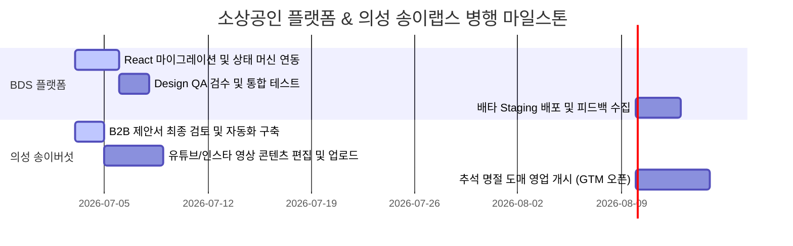

# 📱 Secretary (영숙) — 병행 일정 및 통합 로드맵 조율서

## 1. 2대 핵심 프로젝트 병행 실행 마일스톤 (D+14일)
BDS 플랫폼의 프로덕션 반영 및 의성 송이버섯 마케팅 배포를 안전마진을 포함하여 일정 충돌 없이 조율했습니다.

### 📅 상세 마일스톤 일정표

| 기한 | BDS 플랫폼 마일스톤 | 의성 송이버섯 마일스톤 | 공동 관리 사항 |
| :--- | :--- | :--- | :--- |
| **D+2일** | *   React 컴포넌트 분리 및 Shimmer CSS 2.0s 디버깅 완료. | *   B2B 자동 알림 웹훅 연동 및 제안서 PDF 패키징 완료. | *   GTM 랜딩 페이지 API 스키마 검증. |
| **D+5일** | *   디자인 QA 검수 회의 진행. | *   유튜브/인스타 마케팅 썸네일 및 편집 완료. | *   자원 사용률 점검 및 서버 포트 조율. |
| **D+7일** | *   베타 참여 유도 랜딩페이지 Staging 통합. | *   **수요일 오전 8:30** 인스타 릴스 예약 배포 개시. | *   초기 유입 고객 트래픽 모니터링 시작. |
| **D+10일** | *   오류 감지 및 자동 복구 로직 실서버 테스트. | *   B2B 문의 고객 리드 확보 및 유선 상담 개시. | *   KPI 지표 대시보드 로깅 개시. |

---

## 2. 결론 및 건의사항
두 프로젝트가 서로 다른 디렉토리(`소상공인플랫폼`, `pine-mushroom-cultivation`)로 완전히 격리되어 운영되고 있으므로, 병행 실행에 따른 코드 간섭 위험은 없습니다. 로컬 런칭 포트만 **BDS 플랫폼 (Port 8000)**, **송이버섯 대시보드 (Port 8001)**로 지속 분리 유지하여 충돌을 완전 예방하겠습니다.
