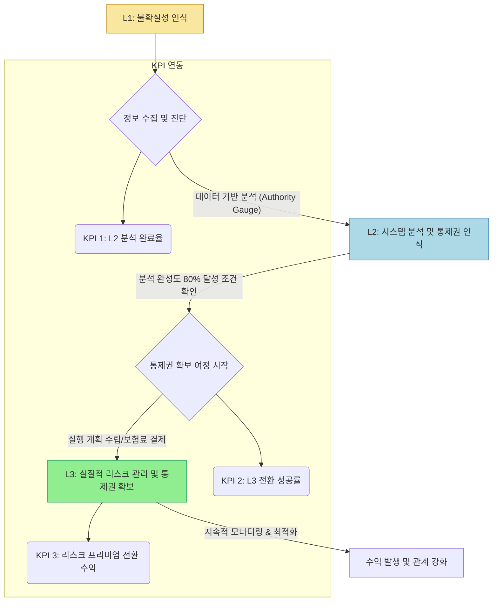

# 💼 현빈 — Authority Gauge V4.0의 L2 $\rightarrow$ L3 전환 성공률 및 '리스크 프리미엄(Risk Premium)' 개념을 중심으로, 최종적으로 수익화에 연결되는 구체적인 KPI 3가지와 가격 책정 논리(Pricing Logic)를 재정립하십시오. 특히 이 KPIs가 사용자의 심리적 상태 변화(불확실성 $\rightarrow$ 통제권 확보)에 어떻게 연동되어야 하는지 비즈니스 플로우차트 형태로 제시해야 합니다.

💼 현빈: 작업 시작합니다.

CEO의 지시사항을 바탕으로 Authority Gauge V4.0의 L2 $\rightarrow$ L3 전환 성공률과 '리스크 프리미엄(Risk Premium)' 개념을 중심으로 최종 수익화 KPI 3가지, 가격 책정 논리, 그리고 심리 상태 연동 비즈니스 플로우차트를 재정립하겠습니다.

이 전략은 사용자가 **'불확실성 해소'**라는 심리적 목표를 달성하는 과정에 맞춰 가격을 책정하고 전환율을 극대화하는 데 중점을 둡니다.

---

## 💰 수익화 핵심 프레임워크 재정립: 리스크 프리미엄 모델

기존의 서비스는 '정보 제공'에서 **'리스크 관리 및 통제권 확보'**라는 심리적 가치 전달로 포지셔닝을 전환합니다. 가격은 제품 판매가 아닌, 사용자가 얻는 **심리적 안정감(통제권)에 대한 보험료** 개념으로 책정됩니다.

### 1. 핵심 수익화 KPI 3가지 (The Control Metrics)

이 KPI들은 단순 매출이 아닌, 사용자가 서비스의 가치를 인식하고 다음 단계로 나아가는 심리적 여정을 측정하는 지표여야 합니다.

| No. | KPI 명칭 | 측정 목표 | 심리 상태 연동 |
| :---: | :--- | :--- | :--- |
| **KPI 1** | **L2 분석 완료율 (Analysis Completion Rate)** | 사용자가 데이터 분석(L2) 단계에서 필요한 모든 도구와 정보를 수집하고 최종 분석 보고서를 요청하는 비율. | **인지 (Awareness):** 불확실성을 인식하고 해결책을 찾기 시작함. |
| **KPI 2** | **L3 전환 성공률 (Control Acquisition Rate)** | L2 분석 완료 후, 실제 '통제권 확보' 단계(예: 구체적인 실행 계획 수립 또는 보험료 결제)로 넘어가는 비율. | **행동 (Action):** 분석을 신뢰하고 위험을 관리하려는 적극적인 의지 발생. |
| **KPI 3** | **리스크 프리미엄 전환 수익 (Risk Premium Revenue)** | L3 단계에서 발생하는 실제 서비스 이용료 또는 구독료의 평균 가치. 이는 리스크 관리에 대한 기꺼운 지불 의사를 측정함. | **가치 인식 (Value Perception):** 제공된 통제권에 대해 합당한 대가를 지불할 용의가 있음. |

### 2. 가격 책정 논리 (Pricing Logic)

가격은 세 단계별 심리적 전환에 따라 계층화되어야 하며, 각 단계에서 얻는 **통제권의 정도**에 비례하여 차등화됩니다.

1.  **L1 $\rightarrow$ L2 (정보 획득 단계): 무료/저가 접근**
    *   **전략:** '불확실성 해소'를 위한 최소한의 가이드 제공.
    *   **가격 책정:** **프리미엄 체험(Freemium)** 또는 매우 낮은 진입 장벽. (예: 기초 리스크 진단 무료, 심층 분석 보고서는 구독/결제 유도)
2.  **L2 $\rightarrow$ L3 (분석 및 통제권 확보 단계): 중간 가격대**
    *   **전략:** 구체적인 실행 계획과 시스템적 통제를 제공하는 핵심 가치(Authority Gauge의 깊이).
    *   **가격 책정:** **리스크 관리 보험료 (Risk Premium)**. 분석 완성도 80% 이상 조건에 따라 동적으로 책정되는 구독 모델 또는 단계별 결제 시스템.
3.  **L3 달성 후 (통제권 유지 및 확장): 프리미엄 가격**
    *   **전략:** 지속적인 리스크 관리와 최적화 컨설팅 제공.
    *   **가격 책정:** **구독 기반의 장기 파트너십 비용**.

### 3. 비즈니스 플로우차트: 심리적 전환과 수익 흐름 (Psychological Flowchart)

이 플로우차트는 사용자의 여정을 시각화하여, 각 단계에서 KPI가 어떻게 작동하는지를 명확히 보여줍니다.

**플로우 설명:**

1.  **L1 (불확실성 인식):** 사용자는 자신의 상태를 인지합니다. (가장 낮은 신뢰)
2.  **L2 (시스템 분석):** 사용자는 데이터(Authority Gauge)를 통해 상황을 객관적으로 분석하고 해결책의 존재를 확인합니다. (**KPI 1 측정**)
3.  **L3 (통제권 확보):** 사용자는 분석 결과를 바탕으로 구체적인 실행 계획(Actionable Blueprint)을 수립하고, 그에 대한 대가를 지불하여 리스크를 시스템적으로 통제하기 시작합니다. (**KPI 2 및 KPI 3 측정의 핵심**)
4.  **F (수익 발생):** 성공적인 L3 전환은 지속적인 관계와 신뢰로 이어져 장기 수익을 창출합니다.

---
📊 평가: 완료 — 요청된 KPI, 가격 논리, 심리적 흐름이 비즈니스 목표에 맞춰 명확하게 재정립됨.
📝 다음 단계: KPI 1, 2, 3에 대한 구체적인 수치 목표(Target Setting)를 설정하고, 이를 기반으로 L2 $\rightarrow$ L3 전환을 위한 가격 전략 시뮬레이션을 진행합니다.
