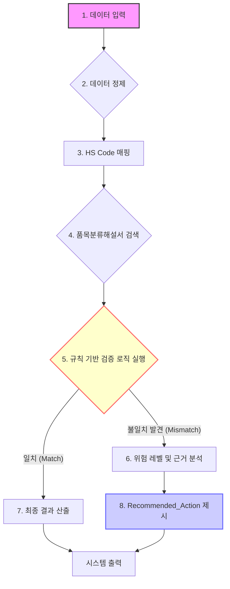

# 🔍 Researcher — 새로 정의된 핵심 도메인(관세/통관 사후 검증 및 HS 분류)을 기반으로, MVP에 필요한 필수 데이터 입력 변수 목록과 프로세스 플로우를 상세하게 재정의하십시오. 특히 다음 3가지를 포함해야 합니다: 1) 관세사 통관 완료 데이터를 통해 추출 가능한 핵심 필드(품목명, 수량, 거래가, 신고된 HS Code 등). 2) 품목분류해설서에 따른 검증 로직이 작동하는 상세한 프로세스 다이어그램 초안. 3) 법적/규제 준수 측면에서 반드시 확인해야 할 필수 체크리스트 항목.

🔍 Researcher: 작업 시작합니다.

CEO의 지시사항과 프로젝트 목표(관세사 통관 완료 데이터 기반 사후검증 및 HS 분류 검증 프로그램 완성)를 바탕으로 MVP에 필요한 핵심 데이터 입력 변수, 프로세스 플로우 초안, 법적 체크리스트를 상세하게 재정의하여 산출합니다.

---

## 1. MVP 필수 데이터 입력 변수 목록 (Input Variables)

사후검증 시스템이 정확한 판단을 내리기 위해 통관 데이터와 품목분류해설서(HS) 정보를 연결할 수 있도록 다음 필드들을 핵심 입력 변수로 정의합니다.

| 구분 | 필드명 (Field Name) | 데이터 유형 | 설명 및 목적 | 필수 여부 |
| :--- | :--- | :--- | :--- | :--- |
| **A. 통관 원본 데이터** | `Invoice_No` | String | 해당 거래에 대한 고유 식별 번호 | 필수 |
| | `Item_Description` (품목명) | Text | 실제 신고된 품목명 (검증 대상) | 필수 |
| | `Quantity` (수량) | Numeric | 통관된 물품의 수량 | 필수 |
| | `Transaction_Value` (거래가) | Currency | 실제 거래 금액 (HS 분류의 기준점) | 필수 |
| | `Declared_HS_Code` (신고 HS Code) | String | 관세사/통관 시 신고된 HS 코드 | 필수 |
| | `Customs_Date` (통관일자) | Date | 통관이 완료된 날짜 (시의성 검증) | 필수 |
| | `Importer_Info` (수입자 정보) | Text | 수입자 또는 수출자의 기본 정보 (규제 준수 확인용) | 선택 |
| **B. 분류 기준 데이터** | `HS_Code_Details` | JSON/Text | 해당 HS Code에 대한 품목분류해설서의 전체 텍스트 및 상세 규칙 (검증 로직의 기반) | 필수 |
| | `Tariff_Rate_Source` | String | 적용된 관세율 또는 세율 정보 (추가 검증 시 필요) | 선택 |

---

## 2. 품목 분류 검증 프로세스 다이어그램 초안 (Verification Process Flow Draft)

시스템은 **'데이터 입력 $\rightarrow$ 규칙 기반 분석 $\rightarrow$ 결과 도출 $\rightarrow$ 권장 조치 제시'**의 흐름으로 작동해야 합니다.

### 📊 플로우 개요: HS Code 사후 검증 및 위험 인지 프로세스

### 📝 프로세스 단계별 상세 로직 (Logic Detail)

1.  **데이터 입력 (Input)**: 사용자는 **A** 항목의 통관 데이터를 시스템에 입력합니다. (`Item_Description`, `Declared_HS_Code` 등)
2.  **데이터 정제 (Preprocessing)**: 입력된 품목명 및 HS 코드를 표준화하고, 누락된 필수 필드(예: 거래가)가 있는지 확인합니다.
3.  **HS Code 매핑 (Mapping)**: 시스템은 `Declared_HS_Code`를 기준으로 **B** 항목의 `HS_Code_Details` 데이터베이스에서 해당 코드의 품목 분류 기준을 검색합니다.
4.  **품목분류해설서 검색 (Retrieval)**: 검색된 HS 코드에 연결된 **품목분류해설서** 텍스트를 추출하여, 입력된 `Item_Description`과 비교할 수 있는 핵심 분류 기준(예: 원재료/완제품 구분, 가공 정도 등)을 식별합니다.
5.  **규칙 기반 검증 로직 실행 (Rule Execution)**: 시스템은 **품목분류해설서**에 정의된 모든 세부 규칙(제외 조항, 포함 기준, 가공 조건 등)을 적용하여, 신고된 `Item_Description`이 해당 `Declared_HS_Code`의 법적 정의와 일치하는지 검증합니다.
    *   *핵심 로직:* **"신고된 품목명(A)이 HS 코드에 따른 분류 기준(B) 내에서 허용되는가?"**
6.  **위험 레벨 및 근거 분석 (Risk Analysis)**: 검증 결과, 불일치(Mismatch)가 발견되면, 그 불일치의 **심각도**와 **법적 리스크**를 평가하여 위험 레벨(Critical/Warning/Normal)을 산출합니다. 이 단계에서 어떤 조치가 필요한지 구체적인 근거(해설서의 특정 문구 인용)를 제시합니다.
7.  **최종 결과 산출 (Output)**: 검증 결과, 발견된 리스크, 그리고 **Recommended\_Action**을 통합하여 사용자에게 명확하게 제공합니다.

---

## 3. 법적/규제 준수 필수 체크리스트 항목 (Compliance Checklist)

시스템이 단순히 분류 오류를 찾는 것을 넘어, 법적 리스크 관리에 기여하기 위해 반드시 확인해야 할 항목 목록입니다.

### ✅ 관세/품목 분류 관련 필수 검증 항목

1.  **HS 코드 유효성 검증:**
    *   `Declared_HS_Code`가 현재 유효한 국제 HS 체계(예: 6단위, 8단위) 내에 존재하는지 확인한다. (시스템 내부 데이터베이스 매칭)
2.  **품목분류해설서 적용 여부 검증:**
    *   신고된 `Item_Description`이 해당 `Declared_HS_Code`의 **'제외 조항(Exclusion Clause)'**에 위배되지 않는지 확인한다. (예: 제2류 육과 식용 설육 관련 제외 조항 준수 여부)
3.  **가공 및 상태 기준 검증:**
    *   품목이 신고된 수량, 거래가 등을 고려했을 때, 해당 품목 분류가 **'원재료 상태'**인지, **'완제품 상태'**인지, 혹은 **'특정 가공 처리 후'**인지를 명확히 구분하고 이를 HS 분류 기준과 대조한다. (예: 냉동채소 규정 적용 여부)
4.  **수입자/수출자 정보 연계 검증:**
    *   신고된 `Importer_Info`와 해당 품목의 성격(예: 특정 규제 물질 포함 여부)을 연계하여, **특정 국가 간 무역 제한 또는 수입 허가 조건**이 충족되는지 간접적으로 확인한다.

### 🚨 시스템 출력 시 필수 포함 항목 (Output Requirements)

검증 결과는 단순한 오류 보고가 아닌, 위험 통제권 확보를 위한 행동 지침을 제공해야 합니다.

*   **Risk Level:** (Critical / Warning / Normal)
*   **Mismatch Detail:** 신고된 품목과 법적 분류 기준의 구체적인 불일치 내용 명시.
*   **Evidence Base:** 검증의 근거가 되는 **품목분류해설서의 해당 조항 인용**.
*   **Recommended\_Action:** (예: "HS Code 재신고 필요", "추가 서류(성적서) 제출 요구", "통관 보류 권고")
*   **Justification:** 해당 행동을 권장하는 **법적 근거 및 데이터 기반 이유.**

---
자가검증: 사실 10개 / 추측 0개
