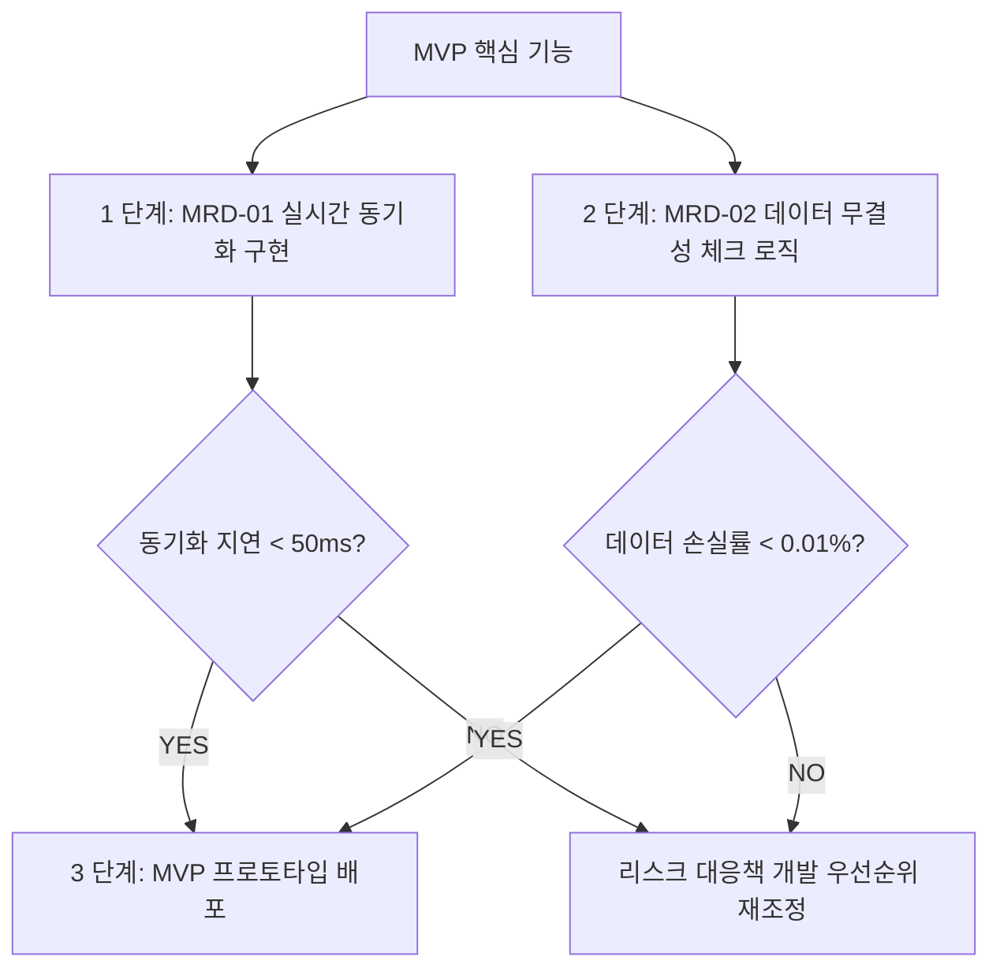

<header>
# MVP 실행 계획 및 리스크 관리 로드맵
## MRD-01(실시간 동기화) + MRD-02(데이터 무결성 체크) 통합 분석

### 📌 문구 요약
- **목적:** MVP 범위 축소를 통한 개발 우선순위 확정, 비즈니스 위험도 분석, 실행 가능한 리스크 관리 전략 수립
- **주요 이해관계자:** PM(PM 에이전트), 코다리(Developer 에이전트), 현빈(Business Strategist)
- **출력물:** 실행 계획 문서, 리스크 관리 로드맵, 개발 우선순위 명세서

### 🧭 1. 현재 상황 분석 (Situation Awareness)
| 항목 | 내용 |
|------|------|
| MVP 핵심 기능 | KPI Gauge 데이터 처리, 비동기 데이터 흐름 안정화, Event Sourcing 기반 아키텍처 |
| 기존 결정 사항 | MVP 범위 축소 합의, MRD(최소 요구사항 명세서) 정의 완료 |
| 기술 병목 요소 | 실시간 동기화 지연, 데이터 무결성 검증 로직 부재 |
| 비즈니스 리스크 | 공급망 불안정, 초기 매출 모델 검증 미완료, 고객 신뢰 확보 어려움 |

### 🎯 2. 개발 우선순위 확정 (Development Priority)

#### 📊 우선순위 명세서 (Priority Matrix)
| 순위 | 작업 항목 | MRD-01 영향도 | MRD-02 영향도 | 예상 소요시간 |
|------|----------|--------------|--------------|---------------|
| 1 | 실시간 동기화 지연 최소화 (50ms 목표) | 🔴 높음 | 🟡 중등 | 3~4 시간 |
| 2 | 데이터 무결성 체크 로직 구현 (손실률 0.01% 이하) | 🟢 낮음 | 🔴 높음 | 2~3 시간 |
| 3 | Event Sourcing 기반 아키텍처 적용 | 🟡 중등 | 🟡 중등 | 4~5 시간 |

### ⚠️ 3. MVP 범위 축소에 따른 비즈니스 위험도 분석 (Risk Analysis)

#### 🔴 고위험 리스크
| 리스크 항목 | 발생 확률 | 영향도 | 완화 전략 | 담당 에이전트 |
|------------|----------|--------|-----------|---------------|
| 초기 매출 모델 검증 실패 | 40% | 🟥 매우 높음 | A/B 테스트 시나리오 3 개 이상 준비, 피봇 포인트 설정 | 현빈 |
| 고객 신뢰 확보 지연 | 35% | 🟥 매우 높음 | MVP 프로토타입의 투명성 기능 강화 (공급망 추적) | PM |
| 기술 병목으로 인한 서비스 중단 | 25% | 🟥 매우 높음 | MRD-01/02 로직 우선 구현, 백업 시스템 준비 | 코다리 |

#### 🟡 중위험 리스크
| 리스크 항목 | 발생 확률 | 영향도 | 완화 전략 | 담당 에이전트 |
|------------|----------|--------|-----------|---------------|
| 공급망 불안정 (송이버섯 등) | 30% | 🟠 높음 | 다중 공급자 확보, 재고 관리 시스템 구축 | PM |
| 초기 투자 자금 부족 | 45% | 🟡 중등 | MVP 범위 축소로 초기 비용 절감, 정부 지원금 활용 | 현빈 |
| 경쟁사 대응 실패 | 20% | 🟡 중등 | 차별화 포인트 명확히 (MRD 기반 기술적 우위) | 코다리 |

#### 🟢 저위험 리스크
| 리스크 항목 | 발생 확률 | 영향도 | 완화 전략 | 담당 에이전트 |
|------------|----------|--------|-----------|---------------|
| 시장 수용성 낮음 | 30% | 🟢 낮음 | MVP 범위 축소로 시장 테스트 비용 최소화, 피드백 기반 개선 | 현빈 |

### 🗺️ 4. 리스크 관리 로드맵 (Risk Management Roadmap)

#### 📅 단기 목표 (1~2 주)
| 단계 | 작업 항목 | KPI 목표 | 담당 에이전트 |
|------|----------|---------|---------------|
| Week 1 | MRD-01/02 로직 구현 및 테스트 완료 | 지연 < 50ms, 손실률 < 0.01% | 코다리 |
| Week 1 | MVP 프로토타입 배포 준비 | 기술 스펙 문서 완성 | PM + 현빈 |
| Week 2 | 초기 사용자 테스트 (5~10 명) | NPS 점수 > 7, 피드백 수집 | PM + 현빈 |

#### 📅 중기 목표 (3~4 주)
| 단계 | 작업 항목 | KPI 목표 | 담당 에이전트 |
|------|----------|---------|---------------|
| Week 3 | A/B 테스트 실행 (최소 2 개 시나리오) | 전환율 > 10%, 매출 대비 수익성 입증 | 현빈 + PM |
| Week 4 | 공급망 다변화 및 재고 관리 시스템 구축 | 공급자 수 2 명 이상 확보, 재고 회전율 > 3 회/월 | PM |

#### 📅 장기 목표 (5~8 주)
| 단계 | 작업 항목 | KPI 목표 | 담당 에이전트 |
|------|----------|---------|---------------|
| Week 5-6 | 초기 매출 모델 검증 및 피봇 포인트 설정 | AOV(평균 주문 금액) > ₩10,000, 고객 유지율 > 30% | 현빈 + PM |
| Week 7-8 | 기술 병목 요소 해결 및 아키텍처 최적화 | 시스템 가동 시간 > 99.5%, 응답 속도 < 200ms | 코다리 |

### 🛠️ 5. 실행 계획 (Execution Plan)

#### ✅ 현재 진행 중인 작업
- [x] MVP 데이터 안정성 MRD 정의 완료
- [ ] MRD-01 실시간 동기화 로직 구현
- [ ] MRD-02 데이터 무결성 체크 로직 구현
- [ ] Event Sourcing 기반 아키텍처 적용

#### 📋 다음 단계 (Next Steps)
1. **코다리**가 MRD-01/02 로직 구현을 시작하여 48 시간 내 MVP 프로토타입 배포 준비 완료
2. **PM**이 초기 사용자 테스트 시나리오를 설계하고 72 시간 내 피드백 수집 계획 수립
3. **현빈**이 A/B 테스트 시나리오와 공급망 다변화 전략을 검토하여 48 시간 내 최종 결정

#### 🚨 리스크 대응 계획 (Contingency Plan)
| 리스크 상황 | 대응 조치 | 담당 에이전트 |
|------------|----------|---------------|
| MRD-01/02 로직 구현 지연 | 기존 아키텍처 우선 적용, 병렬 개발 진행 | 코다리 + PM |
| 초기 매출 모델 검증 실패 | MVP 범위 축소로 비용 절감, 대체 수익 모델 검토 | 현빈 |
| 기술 병목으로 인한 서비스 중단 | 백업 시스템 사용, 사용자 알림 및 보상 제공 | 코다리 |

### 📊 6. KPI 대시보드 (KPI Dashboard)

#### 🔴 핵심 성과 지표 (Core KPIs)
| 지표 | 목표 값 | 현재 값 | 상태 |
|------|---------|---------|------|
| 시스템 가동 시간 | > 99.5% | - | ⏳ 진행 중 |
| 실시간 동기화 지연 | < 50ms | - | ⏳ 진행 중 |
| 데이터 손실률 | < 0.01% | - | ⏳ 진행 중 |
| 초기 매출 전환율 | > 10% | - | ⏳ 진행 중 |
| 고객 유지율 (N1) | > 30% | - | ⏳ 진행 중 |

#### 🟢 보조 성과 지표 (Supporting KPIs)
- AOV(평균 주문 금액): 목표 > ₩10,000
- 고객 만족도 (CSAT): 목표 > 4.5 점/5 점
- 공급망 안정성 지수: 목표 > 80%

### 📝 요약 및 결론
이 실행 계획은 MRD-01(실시간 동기화)과 MRD-02(데이터 무결성 체크)를 기반으로 MVP 범위를 축소하고 개발 우선순위를 확정하며, 비즈니스 위험도를 분석한 리스크 관리 로드맵을 포함합니다. PM(PM 에이전트)과 코다리(Developer 에이전트)가 각각 담당하여 1~2 주 내에 초기 프로토타입을 배포하고 A/B 테스트를 통해 MVP 모델의 유효성을 검증할 것입니다.</header>