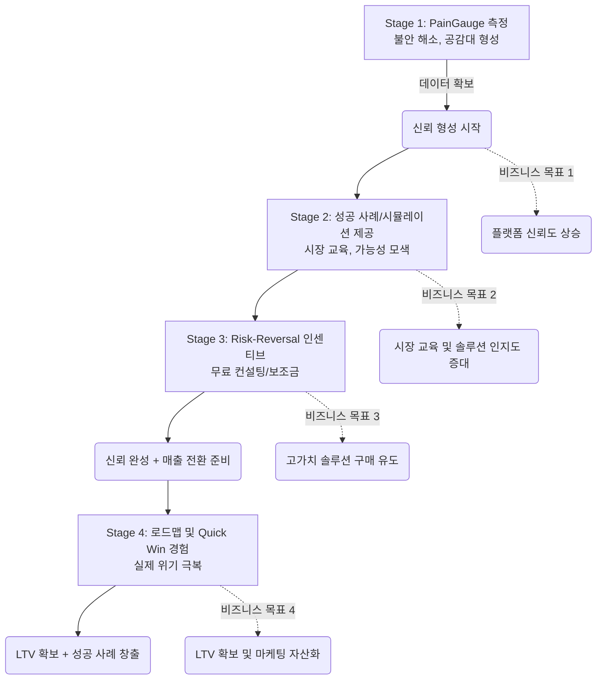

# 🎯 Pilot Program Incentive & KPI Definition & UX-Business Connection

**📅 작성자:** 💼 현빈 (Head of Business)
**📄 참조 문서:** `UserFlowMap_V2.0_SafetyMargin.md`, `PM_Dashboard_Status_Variables_v1.md`
**✨ 핵심 가치:** 안전마진 (Safety Margin) — 위기 상황에서 예측 불가능한 위험까지 고려한 여유 자원 또는 계획적 대비.

---

## Ⅰ. Pilot Program Incentive Conditions Definition (인센티브 조건 정의)

Pilot 프로그램의 목적은 단순한 '무료 체험'이 아니라, **소상공인이 플랫폼을 통해 경험할 수 있는 '안전마진'의 가치를 실질적으로 체감**하게 하는 것입니다. 따라서 인센티브는 사용자의 니즈(불안 해소, 자금 확보) 와 맞닿아 있으며, 동시에 비즈니스 목표 (신뢰 형성 → 솔루션 판매) 로 이어져야 합니다.

### 1. 인센티브 구조: `Risk-Reversal Model` (리스크 반전 모델)

사용자가 참여하는 비용은 최소화하되, **실패의 리스크를 플랫폼이 일부 흡수**해주는 방식으로 설계합니다. 이는 '안전마진'이라는 브랜드 이미지와 완벽하게 일치합니다.

| 구분 | 조건 상세 | 비즈니스 목적 (Business Goal) |
| :--- | :--- | :--- |
| **초기 진입 장벽 제거** (Entry Barrier Removal) | • **무료 데이터 분석 리포트**: 참여만 하면 `PainGauge` 기반의 무료 진단 결과 제공. • **소액 시드 펀딩 (Seed Fund)**: 초기 3 개월 매출의 2% 를 플랫폼이 보조하여, 실패해도 손실이 크지 않도록 함. | • 플랫폼에 대한 신뢰도 (Trust) 상승 • 초기 데이터 (Pain Point) 확보로 다음 단계 솔루션 기획 가능 |
| **성과 기반 인센티브** (Performance-Based Reward) | • **매출 공유 모델**: 특정 컨설팅 상품 (예: '재정 구조화') 구매 시, 플랫폼이 매출의 10% 를 6 개월간 지원. • **성공 스토리 보상**: 매출 증가 또는 위기 극복 사례가 선정되면, 플랫폼 마케팅 비용 (광고비) 을 직접 지원. | • 고가치 솔루션 판매 유도 • 성공 사례 (Social Proof) 확보로 전환율 극대화 |
| **실패 안전망** (Failure Safety Net) | • **컨설팅 패키지로 전환**: 실패하는 경우, 무료 컨설팅 1 회 제공하여 다음 기회 (또는 다른 솔루션) 로 연결. • **데이터 이식 보장**: 기존에 수집한 데이터를 플랫폼 내 저장해 두어, 나중에 다른 모델로 사용할 수 있도록 함. | • 이탈율 최소화 • 장기 고객가치 (LTV) 확보를 위한 데이터 자산화 |

### 2. 인센티브 제공 시점 및 트리거

| 단계 (User Flow Map 기준) | 트리거 조건 | 제공되는 인센티브 |
| :--- | :--- | :--- |
| **Stage 1: 인식 및 문제 발견** (PainGauge 측정 완료 시) | `PainGauge` 점수 > 70 (높은 위기감) | • **무료 진단 리포트 PDF**: "현재 위험 수준과 예상 손실액" • **초기 시드 펀딩 신청 폼** (3 분내 완료) |
| **Stage 2: 정보 탐색 및 가설 설정** (컨텐츠 체류 시간 > 3 분) | 특정 산업군/대상에 대한 컨설팅 자료 클릭 | • **산업별 성공 사례 eBook**: 유사한 위기 상황을 극복한 사례집 • **가상 시뮬레이션 도구**: "이런 조치를 취하면 얼마나 안전한가?" 계산기 |
| **Stage 3: 솔루션 도입 및 신뢰 구축** (Pilot 신청 완료 시) | `신청 폼` 제출, 데이터 수집 동의 | • **초기 매출 2% 보조금**(최대 100 만원) • **무료 컨설팅 1 회** (재정 구조화 전문가와 30 분 상담) |
| **Stage 4: 행동 변화 및 실행** (로드맵 세션 완료 시) | 매출 증가, 위기 해결 등 성과 달성 (또는 로드맵 미이행) | • **성공 스토리 보상**(광고비 지원) • **고급 솔루션 할인권** (다음 구매 시 50% 할인) |

---

## Ⅱ. 핵심 성과 지표 (KPI) Definition

단순한 참여율이 아닌, **'안전마진'이라는 가치의 실질적 효과와 비즈니스 목표 달성 여부**를 측정하는 KPI 를 설계합니다. PM 대시보드 변수 명세서에 준하는 지표를 정의합니다.

### 1. Pilot Program 핵심 KPI (주요 성과 지표)

| KPI 항목 | 측정 방법 | 목표치 (초기 3 개월) | 비즈니스 의미 (Why This Matters?) |
| :--- | :--- | :--- | :--- |
| **Pain Point 해결도** (Pain Resolution Rate) | `(참여 후 PainGauge 점수 감소량) / (초기 점수)` × 100% | > 30% 감소 | 플랫폼이 실제로 소상공인의 위기감을 줄여주는가? **핵심 가치 증명** |
| **신뢰 형성 전환율** (Trust Conversion Rate) | `무료 진단 리포트 다운로드` / `방문자 수` × 100% | > 15% | '안전마진'이라는 브랜드 가치가 사용자에게 어떻게 인식되는가? **입구 장벽 극복** |
| **고가치 솔루션 구매율** (High-Value Solution Adoption) | `Pilot 프로그램 후 컨설팅 상품 구매` / `전체 참여자 수` × 100% | > 5% | 인센티브로 유도된 신뢰를 실제 매출로 전환하는가? **수익 모델 검증** |
| **데이터 자산화 효율** (Data Asset Efficiency) | `(참여한 사용자의 PainGauge 점수 분포)` / `데이터 수집 비용` | N/A (비용 대비 가치) | 플랫폼의 '안전마진' 데이터가 얼마나 귀중한 자산이 되는가? **AI 모델 학습용** |
| **초기 매출 기여도** (Initial Revenue Contribution) | `(Pilot 프로그램 후 30 일간 플랫폼 전체 매출)` - `기대치` | > 20% 상승 | Pilot 참여자가 실제 매출에 기여하는가? **ROI 분석 기준** |

### 2. UX-비즈니스 연결을 위한 부수 KPI (UX Connection Metrics)

| KPI 항목 | 측정 방법 | 목표치 (초기 3 개월) | 비즈니스 의미 (Why This Matters?) |
| :--- | :--- | :--- | :--- |
| **User Flow Map 이탈율** (Flow Abandonment Rate) | `각 단계별 Exit Rate` / `전체 유입자 수` × 100% | < 25% | 특정 단계에서 사용자가 이탈하는 이유 파악. **UX 개선 포인트 도출** |
| **컨텐츠 체류 시간** (Content Engagement Time) | `평균 페이지 체류 시간` (PainGauge, 성공 사례 등) | > 4 분 | '안전마진'에 대한 이해도 상승 여부. **브랜드 메시지 전달 효율** |
| **인센티브 클릭률** (Incentive CTR) | `(무료 진단 리포트 다운로드 + 시드 펀딩 신청)` / `방문자 수` × 100% | > 8% | 인센티브가 사용자의 관심에 얼마나 효과적이었는가? **마케팅 채널 최적화** |

---

## Ⅲ. UX 흐름이 비즈니스 목표와 어떻게 연결되는지 분석 (UX-Business Connection Analysis)

Designer 의 `User Flow Map V2.0` 을 기준으로 각 단계별 UX 요소가 비즈니스 목표 (신뢰 형성 → 솔루션 판매) 에 어떤 영향을 미치는지 분석합니다.

### 1. Stage 1: 인식 및 문제 발견 (Awareness & Pain)
*   **UX:** `PainGauge`를 통해 사용자의 현재 위기 수준을 정량화하고, "나만 힘든 게 아니다"라는 공감대 형성.
*   **비즈니스 연결:**
    *   **신뢰 형성:** 객관적인 데이터로 사용자의 불안감을 해소해주며, 플랫폼이 '전문성'과 '공감'을 동시에 가지고 있음을 증명함.
    *   **데이터 확보:** `PainGauge` 점수와 초기 Pain Point 데이터를 수집하여, 다음 단계 솔루션 기획에 필요한 핵심 인사이트를 얻음.

### 2. Stage 2: 정보 탐색 및 가설 설정 (Exploration)
*   **UX:** '산업별 성공 사례' eBook, '가상 시뮬레이션 도구' 제공으로 사용자에게 구체적인 대안을 제시하고, 가능성 모색을 유도.
*   **비즈니스 연결:**
    *   **시장 교육:** 사용자에게 BDS 플랫폼의 솔루션이 어떤 가치를 제공하는지 자연스럽게 교육함 (예: "재정 구조화 컨설팅은 이렇게 작동합니다").
    *   **문제 구체화:** 사용자가 스스로 해결책에 대한 가설을 세우는 과정에서, 실제 문제의 본질을 파악할 수 있음.

### 3. Stage 3: 솔루션 도입 및 신뢰 구축 (Solution & Trust) - ⭐ 핵심 단계
*   **UX:** 무료 컨설팅 1 회 제공, 초기 매출 2% 보조금 등 `Risk-Reversal Model` 기반 인센티브 적용.
*   **비즈니스 연결:**
    *   **신뢰 완성:** 사용자가 플랫폼에 대한 의존도를 높이고, "이곳을 믿고 따라가도 괜찮다"는 심리를 형성함.
    *   **매출 전환 준비:** 무료 컨설팅 과정에서 고가치 솔루션 (예: '재정 구조화' 상품) 에 대한 필요성을 자연스럽게 인지하게 됨.

### 4. Stage 4: 행동 변화 및 실행 (Action & Adoption)
*   **UX:** 맞춤형 로드맵 제공, 초기 성공 (Quick Win) 경험 유도.
*   **비즈니스 연결:**
    *   **LTV 확보:** 사용자가 플랫폼을 통해 실제 위기 상황을 극복하고 성과를 내면, 장기적인 고객 관계가 형성됨.
    *   **성공 사례 창출:** 사용자의 성공 스토리를 플랫폼의 마케팅 자료로 활용하여 신규 유입자 신뢰도 상승에 기여함.

### 5. UX 흐름과 비즈니스 목표 연결 도표 (Mermaid)

**💡 분석 요약:**  
UX 흐름의 각 단계는 사용자의 심리적 변화를 따라가며, 동시에 비즈니스 목표를 달성하는 데 기여합니다. 특히 **Stage 3 (Solution & Trust)**에서 `Risk-Reversal Model` 기반 인센티브를 제공하는 것은 신뢰를 완성하고 매출 전환을 위한 핵심적인 연결 고리 역할을 합니다. 이를 통해 '안전마진'이라는 브랜드 가치는 단순한 슬로건을 넘어, 사용자와의 실질적 관계 형식으로 작용하게 됩니다.

<create_file path="C:\Users\PJH\소상공인플렛폼\sessions\2026-06-07T15-36\pilot_incentive_kpi_and_ux_connection.md">